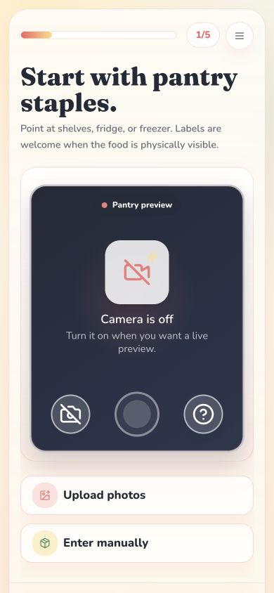
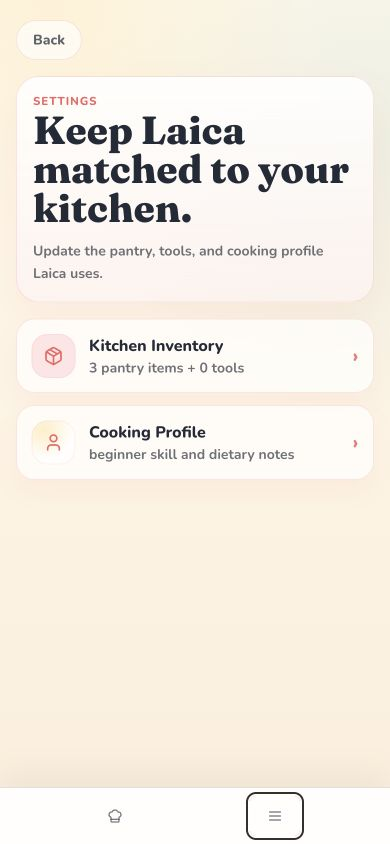

# Production-readiness severity, Effort, and screenshot follow-up

**Agent:** codex
**Branch:** `codex/production-readiness-2026-07-17`
**Date:** 2026-07-20
**Initiative:** INIT-001 / INIT-003
**INIT updated:** yes
**Resolves blocked handoff:** none

## Summary

Wilson reviewed the 2026-07-17 mobile findings and refined their severity and ownership. First-time setup camera/action fit is a subset-phone inconvenience rather than a large blocker and is now EFF-032; returning Settings action overlap, floating placement, and translucent-surface inconsistency must be fixed before production and are now EFF-033; the timer Reset label and Settings blank-scroll tail remain P2 and are now EFF-034. Guest Finish still needs a pre-production product-honesty correction in INIT-003, with one canonical completion outcome driving transcript, speech, and toast only after the relevant persistence result is known.

Four screenshot assets now preserve the current evidence, including Wilson's supplied Pantry screenshot and three Codex-controlled `390x844` captures. No runtime fixes were implemented in this planning follow-up.

## Wilson decisions and evidence corrections

### First-time setup

Wilson can scroll to the lower setup controls on his device and does not consider the compact-phone first-view fit a large production blocker. Codex rechecked the intended `.setup-scroll-body` rather than only the window in the controlled Replit preview:

- App-reported viewport: `390x844`.
- `.setup-scroll-body`: `clientHeight 730`, `scrollHeight 730`, `scrollTop 0`, computed `overflow-y: auto`.
- Next: `top 845.78`, `bottom 893.78`.
- A touch-like scroll left `.setup-scroll-body`, `.setup-phone-frame`, and `window.scrollY` at zero.

This proves the controlled preview had no usable scroll range in that state, but it does not override Wilson's direct-device observation. EFF-032 therefore begins with cross-browser/visual-viewport scroll-owner diagnosis and a smaller camera-height target, not with the claim that setup is universally unscrollable.

### Returning Settings action dock

Wilson's screenshot confirms that the Settings action buttons look detached/floating over the camera and that the rail is visually translucent compared with first-time setup. The controlled preview reproduced the actual hit-target error:

- `Enter manually`: `top 706.58`, `bottom 762.58`.
- `.returning-actions`: `top 689.41`, `bottom 768`.
- Save pantry: `top 704`, `bottom 752`.
- `elementFromPoint()` at the visible manual-entry center returned `Save pantry`.
- `.returning-actions` is sticky over content; its gradient begins at 42% cream opacity. First-time `.setup-bottom-bar` is an in-flow sibling after the setup scroller with a distinct bordered surface.

EFF-033 requires one coherent fix: a solid dock surface, reserved content geometry or a bounded scroller above it, continued clearance above the Cook/Menu nav, and hit-test plus screenshot verification for Pantry and Tools.

Wilson-supplied screenshot:

Codex reproduction:

### Guest Finish recommendation

Recommended implementation, in order of importance:

1. Remove the unconditional linked completion message from `nextStep()`.
2. Let `completeCookingSession()` return or set a typed outcome such as guest-local completion, linked-save success, or linked-save failure.
3. Derive transcript, speech, and toast from one canonical message for that outcome.
4. For guests, use the already accepted honest direction: dinner is ready; sign up before saving cooking history.
5. For linked users, do not say History was saved until `completeSessionMutation.mutateAsync()` succeeds.
6. On linked save failure, do not clear/announce success as if persistence completed; show a retryable failure state consistent with current recovery principles.
7. Reverse the existing guest unit assertion that currently expects `Saved to your cooking history`; add guest rejection, linked-success-after-mutation, linked-failure-no-success, and transcript/speech/toast consistency coverage.

The minimum patch is a guest/linked branch before setting `spokenAssistantResponse`. The recommended outcome-driven implementation is preferable because it also prevents a linked save failure from producing a false success claim.

### P2 findings

EFF-034 preserves:

- Start -> Reset should return a timer to `Start <duration> timer`, while Pause still returns Resume and completion still returns Restart.
- The Settings hub should not create a large blank tail. The controlled `390x844` page measured `documentElement.scrollHeight 1020` and visibly left a substantial empty region below the cards.

## Screenshot provenance

| Asset | Source | Viewport / role |
|---|---|---|
| `2026-07-20-wilson-returning-settings-pantry-overlay.png` | Wilson attachment supplied in the 2026-07-20 review | Direct visual evidence of floating/translucent returning actions |
| `2026-07-20-codex-returning-settings-pantry-overlay-390x844.jpg` | Codex in-app Browser, existing Replit readiness preview | App-reported `390x844`; returning Pantry overlay reproduction |
| `2026-07-20-codex-setup-pantry-first-view-390x844.jpg` | Codex in-app Browser, existing Replit readiness preview | App-reported `390x844`; setup first-view fit and action-rail absence |
| `2026-07-20-codex-settings-root-blank-scroll-390x844.jpg` | Codex in-app Browser, existing Replit readiness preview | App-reported `390x844`; P2 blank-tail evidence |

The Codex captures use the existing candidate preview from the 2026-07-17 run; this follow-up did not sync or retest the dependency-only `origin/main` commits that landed afterward.

## Hygiene result

- Fresh `origin/main` was fetched at `4775ce5f` before filing.
- Open PRs were checked. PR #281 owns cooking-step schema work; the remaining open PRs are dependency, prompt/eval, or closeout work and do not own these UI/copy findings.
- Existing EFF-029 remains resolved history for PR #295's `4 / 5` camera and bottom-nav-clearance slice. EFF-032 and EFF-033 carry genuinely new compact-fit and content-dock scope rather than silently reopening the old acceptance record.
- Blocked handoffs are unrelated to these UI/copy findings.
- No agent entrypoint ID mirrors were added; active membership remains authoritative in `efforts/README.md`.

## Changes

- Added EFF-032, EFF-033, and EFF-034 with linked history, priorities, screenshot evidence, acceptance criteria, and negative scope.
- Added the three Efforts to the active read list and registry.
- Added four screenshot assets under `docs/assets/mobile-refresh/`.
- Updated the production validation registry with Wilson's severity decision, current `origin/main`, and the distinction between the tested candidate and later dependency commits.
- Updated INIT-001 with new assets, Effort ownership, corrected release status, and chronology.
- Updated INIT-003 with the outcome-driven guest Finish recommendation.

## Impact on other agents

- Do not describe the setup first-view fit as a universal/P0 blocker. Read EFF-032 and reproduce the actual scroll owner on the target browser.
- Treat EFF-033 and guest Finish honesty as pre-production work unless Wilson makes another explicit release decision.
- Do not solve EFF-033 with z-index or opacity alone; content geometry and hit targets must pass.
- Coordinate Settings padding changes between EFF-033 and EFF-034 without merging their acceptance criteria.
- Future implementation PRs must commit before/after screenshots with exact viewport/browser provenance.

## Open items

- Runtime implementation has not started for EFF-032, EFF-033, EFF-034, or guest Finish.
- A timer Reset screenshot remains to be captured during EFF-034 implementation because the browser follow-up did not recreate a full cooking guide.
- The latest `origin/main` at `4775ce5f` contains five post-`2686117a` dependency/workflow merges and has not received a new full production-readiness run in this follow-up.
- Exact-candidate post-publish smoke remains deferred until pre-production fixes, full retest, and explicit publish authorization.

## Verification

- Screenshot file type/dimensions and SHA-256 values checked after preservation.
- Controlled-browser geometry and hit-test evidence recorded above.
- `git diff --check` and targeted link/status searches are required before push.

## Stack / base status

- Base refreshed: yes
- Current base: `origin/main` at `4775ce5fc8c0a4bd6dd5148c8e329eb5f0211038`
- Last Replit-validated at: `2686117a202607f2e6b25b2f891d717372e0a6c4` for the full readiness candidate; the 2026-07-20 screenshot follow-up reused that candidate preview
- Notes: the documentation branch was rebased after dependency-only `main` advances; runtime validation was not promoted to the newer base
