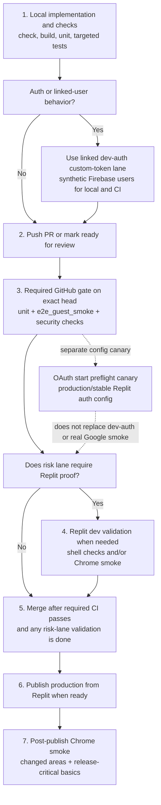

# Testing and Acceptance Workflow

## Operating Principles

Follow [operating-principles.md](operating-principles.md): evidence first, no unsupported assumptions, objective detail, visible rationale and provenance, feedback from first principles, no hacks or duplicate paths, deletion of obsolete paths, explicit decisions, and blocking reports with exact missing inputs and smallest next actions.

This workflow defines how agents decide whether a Laica change is ready to merge, where acceptance criteria live, and how validation evidence is recorded.

## Plain-English Rule

Every change should say what it was expected to prove, what was actually checked, what remains unvalidated, and whether human manual Replit validation is required before merge, deferred to a release/batch pass, or replaced by an accepted automated Replit-environment lane.

For user-facing behavior, verification should also say which user expectation is being protected. Passing structure checks, snapshots, route contracts, or eval harness plumbing is not enough on its own; the evidence should connect back to what becomes better, safer, clearer, faster, less confusing, or more reliable for the user. If a test only proves infrastructure readiness, call it that and name the missing user-expectation check.

The minimal evidence rule is: no claim without evidence, no evidence without a claim, and always name the limit. Use `Value claim`, `Evidence`, and `Evidence limits` for PR bodies, handoffs, eval reports, and future test-case summaries. For docs-only, process, cleanup, or system-maintenance work, the value claim may be operator, reviewer, future-agent, or risk-reduction value rather than direct customer behavior.

For implementation branches, every pushed build intended for review or merge must run or trigger the full automated E2E gate for that exact head. Human Replit smoke is still useful for production-release confidence and risk-triggered PRs, but it is not a substitute for the automated E2E gate. Automated Replit-environment checks may become PR gates when their setup, evidence, and negative scope are documented and accepted.

## Validation Flow At A Glance



Use this as the default order of evidence. Local checks are the fastest implementation loop, GitHub CI is the required PR merge gate, Replit shell/browser validation is risk-triggered or batched for release confidence, and post-publish Chrome smoke verifies the deployed artifact. The OAuth start preflight is a side canary for identity-provider domain/config drift; it is not the local auth test path.

For a plain-English inventory of each environment, database, auth path, and best use case, see [environment-map.md](environment-map.md).

## Automation Evidence Gate

When automated tests are used as a merge gate, the PR or handoff must include an evidence report with full reasoning and provenance before the change is called correct or merge-ready. Do not summarize automation as only "CI green", "tests passed", or "covered by tests."

Required evidence:

- **Value claim:** who is better off and how. For user-facing product or eval behavior, name the protected user promise, such as time fit, dietary safety, pantry usefulness, skill fit, equipment fit, cuisine fit, cooking-step clarity, privacy, or continuity through a workflow.
- **Evidence:** the checks or review that prove the claim, including command/check provenance, source provenance, observed result, and the reasoning that connects the result to the claim.
- **Evidence limits:** what the evidence does not prove, including mocked providers, untested live-provider paths, skipped jobs, fork/draft/secret gates, Replit/human dependencies, stale validation, and deferred follow-up.

Merge-readiness rule: if a PR relies on automated testing to replace or reduce a manual/Replit check, reviewers must be able to reconstruct the proof from the PR description, handoff, and linked logs/artifacts without replaying chat. If the evidence cannot be produced, the automation is not a merge gate yet.

Full E2E gate on pushed builds:

- Runtime, product, client, server, schema, auth, persistence, AI, speech, or user-flow PRs must have the automated E2E gate run or triggered after every pushed build/head intended for review or merge.
- The E2E gate must be tied to the exact head SHA being considered. If new commits land after the last passing E2E run, including docs-only commits on a deployment-bound code PR, the PR description or handoff must either show the new head's E2E result or say the gate is pending/failed.
- Human Replit smoke, automated Replit-environment checks, and local unit coverage are complementary evidence. They cannot replace a missing, skipped, or failed automated E2E gate.
- Draft/fork/secret/config skips are blockers, not passes. If CI skips because the PR is draft, mark the PR ready under the ready-for-review rule when the branch is otherwise complete enough to start automation, then monitor the CI E2E job and update the PR/handoff with the result.
- A local E2E run is acceptable only when it uses a non-production service-backed test environment with schema health verified. A missing table, stale database, unavailable provider secret, port collision, or skipped linked-lane env is a gate failure or blocker until rerun against a valid E2E environment.
- Prefer the GitHub Actions `e2e_guest_smoke` lane for merge-gate E2E evidence when it is available. That lane creates a schema-only Neon branch for the run, applies the current Drizzle schema, runs `db:health`, runs Playwright, and deletes the branch afterward. Local dotenvx runs against a decrypted `.env` database are diagnostic unless `DATABASE_URL` is explicitly pointed at an equivalent non-production test database prepared with the same schema-push and health-check sequence.

Future eval gates follow the same rule. Eval evidence must also identify the fixture/dataset, evaluator version or prompt/model version when relevant, metric/threshold, sample size, failure examples or cluster summaries, privacy/redaction posture, artifact location, and the user expectation each criterion protects. Eval artifacts must follow the applicable privacy and telemetry rules; do not preserve raw prompts, images, audio, tokens, secrets, or user-identifying payloads unless a durable policy explicitly allows that data. Use [evaluations.md](evaluations.md) for the canonical eval discipline and dataset/result routing.

## Risk Lanes And Human Replit Gates

Human manual Replit validation is no longer the default PR merge gate. Classify the branch before closeout:

- **Automation-primary:** CI/local automation covers the changed behavior well enough for PR merge. Human Replit validation is not required before merge.
- **Batched release validation:** low-risk, narrowly scoped runtime changes may merge or remain queued with other related patches after passing automation. The PR/handoff records the deferred manual Replit checks, and the batch is validated before production publish.
- **Manual Replit before merge:** required when the branch is higher risk or cross-functional, changes schema/secrets/deployment/runtime startup, changes auth/session/provider behavior in a way CI or accepted automated Replit-environment checks do not exercise, has weak/skipped automated evidence, or Wilson explicitly asks for PR-level manual validation.
- **Automated Replit-environment gate:** future lane for scripts or CI that exercise the Replit environment without Wilson manually driving the UI. Treat this as a merge gate only after the workflow, environment setup, evidence report, and negative scope are documented.

Risk annotation should stay lightweight and close to the PR or handoff:

| Field | What to write |
|---|---|
| Risk lane | Automation-primary, batched release validation, manual Replit before merge, or automated Replit-environment gate |
| Why this lane | One or two concrete reasons, such as narrow route-boundary change with route tests, or auth/provider behavior not covered by CI |
| Evidence | Exact local/GitHub checks and source files that prove the claim |
| Deferred/manual scope | The smallest Replit or release-batch check still worth doing |
| Future-bug breadcrumb | One sentence naming the user-visible symptom or surface to inspect first if a regression appears |

Do not create a new Effort or broad durable doc for every risk note. Use PR bodies and handoffs for point-in-time risk annotations. Update workflow, PD, INIT, or Effort docs only when a bug or validation result changes future rules.

## Validation Breadth Discipline

For every implementation change, test the happy path and then deliberately look for corner cases across the surfaces touched by the change. Do not stop at "works locally" when the acceptance criteria depend on auth, persistence, AI, speech, uploads, provider secrets, deployment domains, or Replit-only configuration.

Start from documented specs. The acceptance criteria, INIT, PD, feature phase record, route schema, or component contract should tell the agent what "working" means. If the behavior has no durable spec, either update the smallest relevant source of truth first or mark the missing spec as a coverage gap; do not silently invent acceptance criteria from memory.

For new or materially touched tests, use the same lightweight design habit before choosing assertions:

1. What user, operator, future-agent, reviewer, or system value is this protecting?
2. What behavior would break that value?
3. What is the smallest deterministic test that proves the behavior?
4. What does this test not prove?

Do not rewrite existing tests only to add this language. Apply it when a test file is touched for real work, and keep test bodies readable. PR/handoff evidence can carry the full `Value claim` / `Evidence` / `Evidence limits` summary when putting all of that text in an `it(...)` name would make the test worse.

Before closeout, classify the meaningful test cases:

- **Local automated**: covered by Vitest, Playwright, static checks, or deterministic scripts in the local worktree. Cite the command and the specific test file, assertion, route, component, or schema that proves it.
- **Replit automated**: can be run by a script or Playwright/API smoke against the Replit workspace/deployment using real secrets and services. Cite the script or write the exact command if it exists; otherwise mark the automation as proposed, not completed.
- **Replit human validation**: needs a real Replit workspace/deployment plus a human action or judgment, such as Firebase Console/App Check configuration, Google provider popup completion, Replit Secrets/deployment UI changes, production-domain checks, visual judgement, or product acceptance.
- **Replit confidence gap**: locally covered but not trusted until Replit proves the environment seam, such as DB schema availability, Firebase authorized domains, App Check token behavior, provider network access, ElevenLabs audio, Linux/native upload behavior, or dev-vs-prod database separation.
- **Not covered / deferred**: intentionally out of scope. State why, where the deferral lives, and the smallest future test that would close the gap.

Use visible reasoning and provenance. A good validation note says: "This case is local-only because the provider is mocked in `tests/unit/...`; Replit still needs to prove the real provider call and secret." A weak note says only: "covered by tests."

When asked for an app-wide test pass, separate "all existing automated tests" from "all app functions mapped to documented specs." The first is a command; the second is a coverage audit. A true app-wide coverage audit should enumerate the documented product functions, cite their source docs, map each function to local/Replit/human checks, and identify missing specs or stale tests.

If a case is important enough to list and can be automated safely in the current branch, add the test. If it cannot be automated safely, mark the human/Replit dependency explicitly instead of implying confidence.

## Standard Local Automation Commands

Use the repo scripts instead of ad hoc `npx` commands so validation evidence stays consistent across handoffs and CI:

- `npm run test:unit` — Vitest unit suite.
- `npm run test:e2e` — Playwright E2E (Chromium) against the local dev server.
- `npm run test` — runs unit + E2E.
- `npm run db:health` — database schema preflight check for known drift vectors (required before DB-backed E2E).

For dotenvx-backed local E2E in macOS worktrees, link `.env.keys` first and run the E2E server on a known-free port. Use the repo-pinned `env:run` script instead of one-off `npx @dotenvx/dotenvx` commands so the dotenvx binary comes from `package-lock.json` / `node_modules` and is not fetched at the moment secrets are decrypted:

```bash
ln -sf /Users/wilsonishak-macbookpro/src/laica/.env.keys .env.keys
PORT=3000 PLAYWRIGHT_BASE_URL=http://127.0.0.1:3000 npm run env:run -- npm run db:health
PORT=3000 PLAYWRIGHT_BASE_URL=http://127.0.0.1:3000 npm run env:run -- npm run test:e2e
```

If the decrypted `.env` database fails `db:health`, do not run `db:push` against it by default. Use the [Local Diagnostics Sandbox](local-diagnostics-sandbox.md) helper with a disposable/non-production database instead:

```bash
LAICA_LOCAL_SANDBOX_DATABASE_URL='postgresql://...' \
LAICA_LOCAL_SANDBOX_CONFIRM_SCHEMA_PUSH=true \
PORT=3000 \
PLAYWRIGHT_BASE_URL=http://127.0.0.1:3000 \
npm run env:run -- npm run test:e2e:sandbox
```

Use a different free port if `3000` is already occupied. Avoid the default `5000` on macOS when AirPlay/Control Center is listening there; otherwise Playwright can target the wrong listener and produce misleading blank-page failures.

Secret safety note:
- Replit and dotenvx expose secrets to child processes through environment variables. Do not inspect or ask others to inspect full process environments with commands such as `ps eww`, `env`, `printenv`, `set`, or `/proc/*/environ`; they can print API keys and private config verbatim. Use masked presence checks for named variables, for example printing only `set` or `MISSING`.

CI note (automation harness foundation):
- The protected GitHub ruleset mechanically requires the `unit` and `e2e_guest_smoke` checks for protected merges. A same-repo implementation PR that is ready for review should not treat a missing, pending, failed, or unexpectedly skipped required check as merge evidence.
- The GitHub Actions guest-lane E2E job is intentionally gated on repo `vars` / `secrets` for Neon + Firebase + ElevenLabs. If those are not configured on a reviewable same-repo PR, the skipped guest smoke + `db:health` path is a setup blocker, not a pass and not a change in the Replit-authoritative validation policy.
- When configured, the guest-lane E2E job is the preferred routine automation path for DB-backed guest smoke evidence because it provisions a disposable non-production Neon branch and applies the current schema before testing.
- The guest-lane E2E smoke should avoid paid AI/provider calls by default. If the server cannot start because an unused provider client is created at module load, treat that as a startup isolation bug or split it into an explicit live-provider canary; do not silently expand the guest smoke's secret contract.
- When a draft PR is complete enough to need GitHub Actions evidence, agents should use the ready-for-review rule in [`agent-merge-authority.md`](agent-merge-authority.md) to mark it ready and monitor CI instead of waiting on Wilson only to start automation. The PR or handoff must still record pending checks as pending, then replace that with observed results and negative scope after CI completes.
- Unit coverage reporting should include all intended shipped source files before any threshold or ratchet is proposed. Coverage remains a measurement integrity signal; do not use a higher or lower percentage as a substitute for behavior-specific happy-path, corner-case, and non-happy-path tests.
- Firebase-backed CI E2E and production/provider OAuth preflight must use separate GitHub secret lanes. The `e2e_guest_smoke` lane maps `CI_FIREBASE_*` secrets into the app's runtime `VITE_FIREBASE_*` / `FIREBASE_SERVICE_ACCOUNT_BASE64` env names so custom-token exchange stays inside the `laica-ci-test` Firebase project. The OAuth start preflight uses `OAUTH_PREFLIGHT_FIREBASE_API_KEY` and accepted target secrets for the production/provider canary. Do not point both lanes at a shared `VITE_FIREBASE_API_KEY` secret.
- The OAuth start preflight is a separate scheduled and manually dispatchable canary lane for identity-provider start configuration. It proves that Google OAuth can create an authorization URI for the accepted HTTPS target set; it does not complete the Google popup, prove account linking, or replace linked dev-auth CI and risk-triggered Replit/Chrome validation. Public workflow logs should stay sanitized; accepted target sets should be secret-backed when they are not intended as public log output, and exact provider diagnostics/settings payloads belong in private/local evidence under the security due-diligence rule.

CI gap-lane rule:
- Do not summarize important CI gaps as a single generic "not covered" bucket. Assign each gap to the smallest honest validation lane: routine deterministic CI, mocked unit/component coverage, forced-response Playwright smoke, OAuth-start/config preflight, live-provider canary, Replit automated check, or Replit human validation.
- Keep default PR CI deterministic and provider-light unless a durable decision expands the routine gate. Real Google popup completion, live model/audio quality, production-domain checks, and Replit deployment behavior should remain separate named lanes until their automation is deliberately accepted.
- When a user-facing boundary is expensive to reach naturally, prefer a forced-response or fixture test that proves the UI contract directly. For example, a guest quota-copy check can stub `403 LINKED_ACCOUNT_REQUIRED` instead of spending ten real recipe generations to reach attempt `#11`.

Signup-continuation risk check:
- After E2E on changes that touch guest promotion, signup-required copy, quota walls, linked-only save boundaries, guest-to-linked conversion, or navigation into those surfaces, explicitly record whether the continuous journey is covered: guest reaches a signup-required moment, signs up or links, returns to the expected linked state, and preserves or resumes the intended action/data.
- The custom-token linked-auth lane proves the signed-in destination state and linked-only behavior; it does not by itself prove the continuous guest-blocked -> sign-up/link -> continue journey or the real Google popup. If routine CI covers the guest block and the linked destination separately, record the continuous journey as an optional but relevant validation gap and choose the smallest follow-up lane based on risk: targeted Playwright with dev auth, Replit human validation, or a future identity-provider/preflight check.

E2E note: browser automation depends on service-backed env (at minimum a `DATABASE_URL` that points to a non-production test database). Keep E2E flows privacy-forward by using synthetic data and by avoiding production/Replit databases.

## Bug and Regression Closeout

When testing or user validation finds a bug, close the loop before merge readiness:

- Start with investigation evidence before prescribing a fix. Do not treat the initial bug report, screenshot, or first plausible clue as complete when the affected surface can expose better evidence.
- Reproduce or document the exact evidence: observed behavior, expected behavior, environment, branch/SHA, and affected user flow.
- Classify the bug as product behavior, implementation defect, environment/schema drift, stale test coverage, missing acceptance criteria, or workflow/process gap.
- Add a regression test when the bug is locally deterministic. If it depends on Replit-only services, secrets, provider state, Firebase Console settings, speech/audio, or human judgement, record the exact Replit re-test instead.
- Mark stale validation explicitly. If the bug was found after a previous Replit pass, the old pass is no longer merge evidence for the affected surface until the fixed SHA is re-tested.
- Update the smallest durable doc that future agents need: PD or phase record for product/security policy, INIT for initiative status and validation state, workflow doc for repeatable testing discipline, Effort only for standalone follow-up, and handoff/PR for point-in-time evidence.

A bug fix is not done when only the code changes. It is done when the fix, coverage or validation gap, stale-validation status, and reusable lesson are discoverable from the repo and PR without replaying chat.

### Bug Investigation Evidence Protocol

Use the smallest evidence set that can distinguish root causes before changing code or declaring the issue environmental. Label each note as evidence, inference, or missing input. If the next useful fact is in Wilson's browser or Replit UI, ask for that exact screenshot, response body, log excerpt, or command output instead of guessing.

For browser/UI bugs, collect the relevant route or screen, exact reproduction steps, observed and expected behavior, browser Console errors, and Network request status, content type, and **Response** bodies for the affected calls. Payload-only screenshots are not enough when the server can return terminal states such as `disabled`, `unavailable`, `pending`, `image_not_approved`, `RATE_LIMITED`, or provider/storage errors. Inspect DOM or client state when the bug is about a transient visual state, stale render, reload, cache, or auth-scoped data.

For Replit/runtime bugs, verify the running code and environment separately because git state, deployed runtime, secrets, database, and browser session can drift independently. Capture `git status --short --branch`, `git rev-parse HEAD`, and the relevant remote ref such as `git rev-parse origin/main` or the PR branch. Preserve local Replit commits on a side branch before any destructive sync. Capture server logs around the failing route, route status/response body, and relevant DB/cache rows or failure reasons when the feature uses persisted state. If an API route returns an HTML shell, prove whether the current server has restarted and whether the route is registered by checking the expected JSON status for an authenticated or deliberately unauthenticated request.

For env and secret-backed bugs, never ask for or print secret values. Do not use full environment dumps such as `ps eww`, `env`, `printenv`, `set`, or `/proc/*/environ`. Use targeted masked presence checks that print only `set` or `MISSING`, and include only non-secret config values when needed for diagnosis. Replit Secrets/Configurations are external runtime state and may differ from git or previous validation; record which values were verified present without exposing their contents.

For provider-backed or generated-media bugs, separate the user-facing symptom from the provider/cache pipeline. Capture the app route response, provider-disabled or unconfigured reasons, moderation/judge rejection reasons, storage/upload status, rate-limit state when relevant, and recent cache rows. A UI spinner that appears briefly and then stops may be correct client behavior for a terminal `unavailable` response; that observation does not by itself identify why the route returned `unavailable`.

If evidence contradicts an earlier theory, update the theory. If evidence remains missing, write the blocking report with the exact missing input and the smallest next action, then stop short of a root-cause claim.

## Auth-Scoped Client State

When a change touches browser-local state, client caches, or persisted in-progress UI state for an auth-gated flow, treat identity switching as part of the acceptance criteria.

- `localStorage`, `sessionStorage`, IndexedDB, in-memory stores, and TanStack Query keys that can affect profile, pantry, planning, history, cooking, billing, quota, or settings behavior must be scoped by the real auth identity and mode when the same browser can hold guest and linked users.
- A cache key that is only the route path, such as `/api/user/profile`, is not enough when the value is user-specific and the query cache can outlive an auth switch.
- Browser-local guest state may persist across normal reopen, but it must not be restored into a later linked account or another linked account on the same browser.
- Legacy unscoped keys should be removed or explicitly migrated with a documented owner and validation plan; do not silently keep reading old cross-user state.
- Provider auth state alone is not enough when the server owns product gates. If Firebase anonymous auth, App Check, quota, or kill-switch policy is involved, the client must verify the authoritative backend session before routing the user into protected app state.
- Tests should include a same-browser identity switch when practical: guest to linked, linked account A to linked account B, and stale legacy key to current scoped key. If this requires Replit because Firebase/Google is involved, list it as Replit human validation instead of treating local unit coverage as complete.

## Source of Truth

| Need | Durable home |
|---|---|
| Feature acceptance criteria | Relevant feature phase record in `product-decisions/features/<feature>/` |
| Initiative status, current phase, PR/branch state, and validation state | Relevant `initiatives/INIT-*.md` |
| Stable cross-feature testing rule or workflow | `docs/workflows/` or a top-level PD |
| Point-in-time command output, manual checks, and branch status | PR description and `docs/handoffs/` |
| Replit validation focus by drift vector | [`docs/workflows/replit-validation-focus.md`](replit-validation-focus.md) |
| Durable AI eval workflow, run/intake registry, and normalized intake records | [`docs/workflows/evaluations.md`](evaluations.md), [`docs/evals/registry.md`](../evals/registry.md), and [`docs/evals/intakes/`](../evals/intakes/) |
| Focused security checks from recent scan learnings | [`docs/workflows/security-due-diligence.md`](security-due-diligence.md) |
| Local-vs-Replit authority | [`docs/adr/0001-replit-primary-local-agents.md`](../adr/0001-replit-primary-local-agents.md), `AGENTS.md`, and `CLAUDE.md` |
| Cross-doc routing and closeout | [`docs/workflows/documentation-routing.md`](documentation-routing.md) |
| Docs-only workflow PR auto-merge authority | [`docs/workflows/agent-merge-authority.md`](agent-merge-authority.md) |

Do not use an Effort file as the long-term ledger for every feature's validation history.

## Default Validation Matrix

| Change type | Minimum local checks | Replit validation |
|---|---|---|
| Docs-only | `git diff --check` | Not required |
| Pure frontend copy/layout with no service behavior | `npm run check`, `npm run build` when practical; targeted visual/manual review | Human Replit only if deployment-bound visuals/auth-gated flows need live inspection; otherwise record visual negative scope |
| Client logic or shared user-flow state | `npm run check`, `npm run build`, targeted Vitest/Playwright when existing coverage matches | Human Replit before merge only when the risk lane requires real auth, persistence, AI, speech, mobile/browser, or human judgement; otherwise defer to release/batch if relevant |
| Server route, shared schema, auth, DB, AI, speech, or feedback writes | `npm run check`, `npm run build`, targeted tests plus automated E2E gate when applicable | Human Replit before merge only for high-risk or uncovered service seams; low-risk route-boundary patches may use automation-primary or batched release validation with risk notes |
| DB schema or migration workflow | Local static/build checks plus schema review | Usually manual or automated Replit-environment validation before merge/release; coordinate schema push through the Replit-authoritative path unless disposable CI schema evidence fully covers the PR claim |
| Workflow/process docs | `git diff --check` and link/reference search | Not required |

## Feature Impact Review

Before locking direction for a feature enhancement, review the adjacent system surfaces it may affect:

- User-facing copy and error-message taxonomy.
- Parser/body limits, upload limits, request size limits, and rate limits.
- Auth, ownership, persistence, and valid empty states.
- Auth-scoped browser state and client cache isolation across guest, linked, sign-out, and account-switch transitions.
- In-flight async work, Back/cancel behavior, stale-result handling, and navigation away from the surface.
- Related INITs, active Efforts, PDs, workflow docs, and phase records.
- Security due diligence for auth ownership, private caching, admin data, external scripts, provider abuse limits, and prompt-input boundaries; use [`security-due-diligence.md`](security-due-diligence.md) for the focused checklist.
- Telemetry/privacy rules, especially [`PD-010`](../../product-decisions/pd-010-ai-error-telemetry-allowlist.md) for AI error logging.
- Settings/setup parity, post-cook or future rescan implications, and any sibling surfaces that share the same component or API.

The scan upload policy review that produced [`PD-011`](../../product-decisions/pd-011-scan-upload-photo-limit-policy.md) is the model: it considered scan copy, route limits, image-count rate limits, telemetry allowlists, Settings behavior, empty-Pantry state, active-scan cancellation, and related Efforts before the policy was accepted.

## Required Handoff / PR Verification Notes

Every implementation handoff and PR description should include:

- Commands run and whether they passed.
- Automation evidence reports for any automated test used as a merge gate: claimed behavior, command/check provenance, source provenance, observed result, reasoning, and negative scope.
- A coverage classification that separates happy paths, corner cases, local automation, Replit automation, Replit human validation, confidence gaps, and explicitly deferred scope.
- Manual checks performed.
- Validation lane and human Replit status, including `Last Replit-validated at: <sha>`, `Human Replit validation: deferred to release/batch validation`, or `Human Replit validation: not required before merge` with rationale.
- What was intentionally not tested.
- Any accepted deferrals and where they are tracked.
- Whether docs were updated: INIT, feature phase record, PD, active Effort, workflow doc, and handoff as applicable.

Before closeout, use [`documentation-routing.md`](documentation-routing.md) to choose the smallest durable doc home and update only the indexes/read lists whose source-of-truth status changed.

## Resolved Effort History

This workflow graduates the useful parts of former EFF-005 and EFF-020:

- Former EFF-005 asked for an app-wide testing strategy and acceptance criteria workflow.
- Former EFF-020 asked where workflow documentation, Feature Impact Review, and validation evidence should live.

Both are now resolved as standalone Efforts. Future changes should update this workflow, the Replit validation focus guide, or the relevant INIT/phase record instead of reopening those Efforts.
