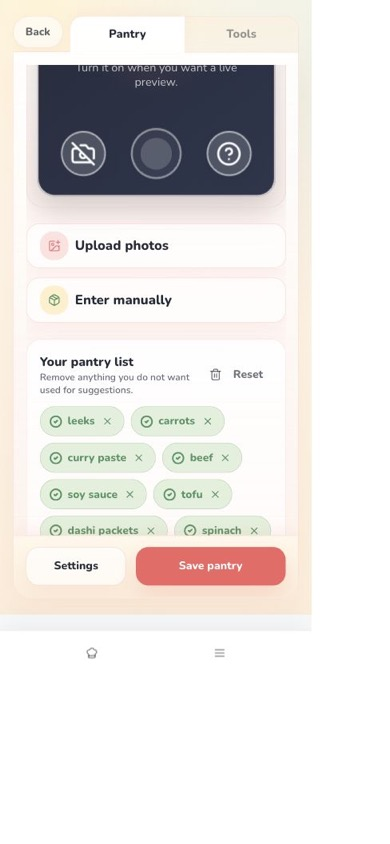
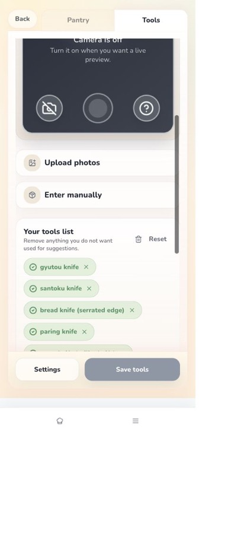
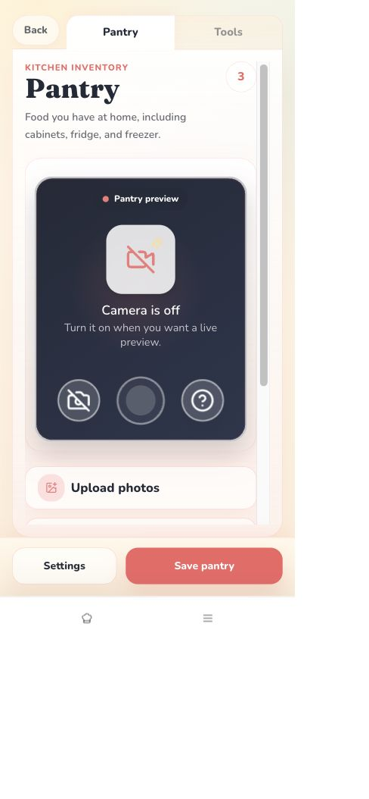
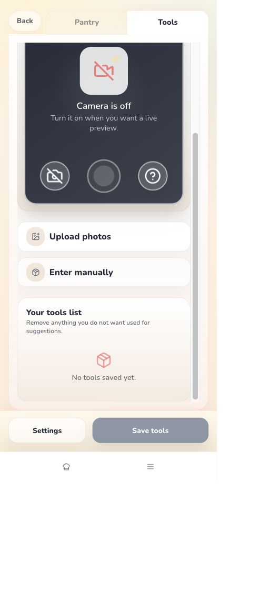
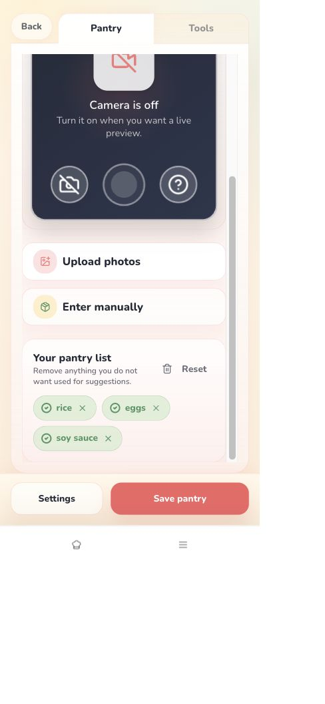

# EFF-033: Returning Settings inventory action-dock parity

**Status:** In Progress
**Priority:** Pre-production
**Owner:** Wilson / Codex / Claude
**Created:** 2026-07-20
**Updated:** 2026-07-21
**Linked Initiative:** [INIT-001 - Mobile Refresh](../initiatives/INIT-001-mobile-refresh.md)
**Linked Effort history:** [EFF-029 - Setup/Settings camera height and action clearance](effort-029-settings-camera-action-clearance.md)
**Related docs:** [Phase 2.2 Returning Setup / Settings](../product-decisions/features/mobile-refresh/pd-phase-02-2-returning-setup-settings.md), [PD-005 UI Governance](../product-decisions/pd-005-ui-governance.md), [design guidelines](../design_guidelines.md), [production-readiness follow-up](../docs/handoffs/2026-07-20-codex-production-readiness-effort-routing.md)

## One-line summary

Make returning Settings Pantry/Tools actions a visually solid, non-overlapping dock above the app nav, using the first-time setup action rail's containment principles while preserving Settings behavior.

## Context

PR #295 / EFF-029 moved returning Settings actions above the authenticated Cook/Menu bottom nav, but the 2026-07-17 production-readiness pass exposed a second problem inside the Settings content itself. At app-reported `390x844`, `Enter manually` measured `706.58px` to `762.58px`, while the sticky action rail measured `689.41px` to `768px` and the Save button measured `704px` to `752px`. Hit-testing the visible manual-entry center resolved to `Save pantry`.

Wilson's 2026-07-20 screenshot and review identified the accompanying visual inconsistency: the Settings actions look like floating buttons over the camera, and the rail appears transparent compared with the first-time setup rail.

The source confirms a meaningful structural difference:

- First-time setup renders `.setup-bottom-bar` as an in-flow flex sibling after `.setup-scroll-body`, with a bordered cream surface.
- Returning Settings renders `.returning-actions` as `position: sticky` over document content. Its gradient begins at `hsl(var(--returning-cream) / 0.42)`, allowing underlying camera/content to show through.

The issue is therefore not only bottom-nav clearance. The returning rail needs its own visible surface and reserved content geometry so it cannot cover another actionable control.

Wilson-supplied screenshot:

Codex controlled-browser reproduction at `390x844`:

Draft PR #325 first-pass after-state at app-reported `390x844` and `412x915` (superseded after Wilson's 2026-07-21 review because the dock was still panel-contained with a permanent nav gap):

Corrected page-level after-state:

Finalization screenshots after the PR #330 harness repair and current-main rebase:

## Scope

- Target returning Settings -> Kitchen Inventory -> Pantry and Tools for guest and linked modes where the shared returning surface applies.
- Preserve the pinned/docked action behavior above the Cook/Menu bottom nav.
- Give the Settings action rail a visually solid/opaque surface so camera or list content does not show through it.
- Apply the first-time setup principles that matter here: a distinct rail surface, clear border/separation, stable action containment, and one owned scrolling region above the rail.
- Reserve enough content space or restructure the shell so `Upload photos`, `Enter manually`, list controls, and dirty reminders never sit underneath the action dock.
- Keep Settings and Save/Save changes buttons readable and tappable on a page-level rail that spans the viewport rather than inheriting the inventory card's width or rounded containment.
- Make the action rail's bottom edge meet the Cook/Menu nav's top edge with no permanent spacer band.
- Verify Pantry and Tools, clean and dirty states, section switching, Back/leave prompts, and bottom-nav clearance.
- Save before/after screenshots at the tested iPhone- and Pixel-like viewports.

Out of scope:

- Changing bottom-nav items, order, labels, or auth visibility.
- Changing scan providers, camera/upload/manual-entry behavior, save APIs, schema, prompts, or inventory semantics.
- First-time camera compact sizing; [EFF-032](effort-032-setup-inventory-camera-compact-fit.md) owns that follow-up.
- Settings hub blank-scroll cleanup and timer wording; [EFF-034](effort-034-production-readiness-mobile-p2-cleanup.md) owns those lower-severity findings.

## Decisions made so far

- Wilson requires this fix before the next production push.
- Treat visual opacity and hit-target clearance as one action-dock problem, not separate cosmetic and padding patches.
- Reuse first-time setup containment principles without copying unrelated setup positioning or changing durable navigation.
- The final rail should not rely on translucency over interactive content. A solid surface plus reserved scroll/content space is preferred over increasing z-index alone.

## Implementation decisions

- Use a bounded internal inventory scroll body in the centered Settings content shell, followed by a separate in-flow dock that is a direct child of the fixed inventory page. This keeps content containment while giving the rail viewport-wide page ownership.
- Keep the implementation returning-specific because first-time setup and returning Settings have different top-level shells, but enforce the shared containment principles with DOM, CSS, geometry, opacity, and hit-target regression coverage.
- Share an explicit `--app-bottom-nav-height` boundary between the inventory page and Cook/Menu nav. The inventory page ends exactly at the nav's top edge, so its page-level dock is flush to navigation without overlapping it. The broader returning-page breathing-space token remains unchanged for non-inventory Settings surfaces.

## Agent checklist

- [x] Start from the requested production-readiness base `08fa856d` and confirm no open branch owns returning Settings inventory layout.
- [x] Read EFF-029, INIT-001, Phase 2.2, PD-005, `design_guidelines.md`, and the 2026-07-20 readiness follow-up.
- [x] Inspect `UserSettings`, `.returning-ui`, `.returning-inventory-panel`, `.returning-actions`, `.setup-bottom-bar`, and the app-shell bottom nav together.
- [x] Verify Pantry and Tools at `390x844` and `412x915`, including clean and reversible dirty states.
- [x] Add geometry/hit-test coverage proving visible camera-toggle, manual/upload/list, Settings, and Save controls are not covered by the dock.
- [x] Add computed-style evidence for a visually solid rail and compare it with first-time setup containment.
- [x] Verify the dock is a direct page child, spans the viewport horizontally, and has zero rendered gap to Cook/Menu navigation.
- [x] Save before/after screenshots in `docs/assets/mobile-refresh/` and link them from the handoff/PR.
- [x] Run focused Settings tests, full unit, check, build, and exact-runtime-head Replit mobile validation.
- [x] Execute and inspect the pre-harness-correction full automated E2E/security gate; both EFF-033 tests passed, while the added ninth browser context exposed the shared Vite/app-asset limiter and left the lane at 8/9. This was not evidence of a linked auth/planning runtime regression.
- [x] Re-run the full automated gate on the rebased PR #325 review head after merged PR #330; GitHub run `29865935383` executed and passed all nine Playwright tests. Repeat this gate after the evidence-only handoff commit so the final pushed head also has exact-head evidence.

## Resolution criteria

1. Returning Pantry and Tools actions render on a distinct, visually solid, viewport-wide page dock immediately above the fixed app nav.
2. No camera, upload/manual, list, dirty-reminder, or other interactive content is visible through or hit-testable underneath the dock.
3. `elementFromPoint()` at visible control centers resolves to the intended control at `390x844` and `412x915`.
4. Save, Save changes, Settings, leave/switch prompts, scanning, upload, manual entry, and bottom-nav behavior remain correct.
5. First-time/returning visual comparison and before/after screenshots are committed with exact viewport provenance.
6. The dock is not nested in the centered inventory content shell, and its rendered bottom equals the bottom nav's rendered top within one CSS pixel.

## 2026-07-20 - Effort filed from production-readiness review

Wilson confirmed the returning Settings action rail must be fixed before production and added opacity/parity to the accepted scope. The original EFF-029 remains resolved history for camera proportion and bottom-nav clearance; this new Effort owns the newly observed content-overlap, floating-dock, and translucent-surface behavior.

## 2026-07-20 — Draft PR #325 implements and validates the contained dock

Draft [PR #325](https://github.com/wmishak404/laica/pull/325) on `codex/eff-033-settings-action-dock` starts from the requested production-readiness commit `08fa856d`. Runtime commit `af603822855be23e790769f77969dace803aabd4` makes returning Pantry and Tools use one bounded `.returning-inventory-scroll` above a sibling `.returning-inventory-actions` dock. The dock is in flow (`position: relative`, `z-index: auto`), has an opaque cream-to-cream-deep surface, and remains inside a Settings root that ends above the existing bottom-nav clearance.

Replit workspace validation used direct shell and browser control without Replit Agent. Guest and linked Pantry/Tools passed at app-reported `390x844` and `412x915`: the scroll bottom equaled the dock top, the dock ended `40px` above bottom navigation, active controls were `48px` to `64px` tall, and center-point hit tests resolved to the active camera toggle, upload/manual controls, Settings, and Save. Clean state, reversible dirty state, long-list scrolling, and focused manual-entry viewport-resize probes (`390x564` and `412x635`) also remained clear of the dock and nav. Computed dock colors were opaque `rgb(255, 248, 235)` plus `linear-gradient(rgb(255, 248, 235), rgb(253, 238, 217))`; no browser warning/error logs appeared.

Local focused Settings coverage passed `17/17`, the full unit suite passed `390/390`, and `npm run check` plus `npm run build` passed. A focused local guest Playwright attempt is not evidence for the dock because anonymous Firebase auth stopped before Settings; the final exact-head GitHub E2E/security gate remains a live PR requirement. EFF-033 stays `In Progress` until PR #325 merges and the mechanical Effort closeout records the merged and exact-head evidence. EFF-032, EFF-034, and Guest Finish remain unchanged.

## 2026-07-21 — Wilson rejects panel-contained first pass; page-level dock validated

Wilson's review of the first-pass Replit build established that overlap prevention alone was insufficient. The opaque dock still inherited the rounded inventory panel's horizontal bounds and ended `40px` above Cook/Menu, unlike FTUE's page-owned bottom rail. Source and rendered evidence separated the causes: the dock remained nested under `.returning-inventory-panel`, the fixed inventory page used a `4.75rem` clearance while the rendered nav was approximately `3.5625rem` high, and the centered Settings shell retained bottom padding.

Runtime commits `6fa2ee9d0601c42b698a31763530c01b62899e2a` and `3a42ad6b0deef46b59457e5a505adc617292146c` move the dock outside the centered content shell as a direct child of `main.returning-ui-inventory`, preserve the bounded inventory scroller, and share `--app-bottom-nav-height` with `.app-bottom-nav`. The dock's outer surface is viewport-wide while its two-button grid remains centered to the normal content maximum. The follow-up style commit restores the `returning-setup-anchor` variable/specificity contract on the new page-level dock after Replit computed-style inspection caught a transparent Save background.

Direct-shell Replit validation at runtime head `3a42ad6b0deef46b59457e5a505adc617292146c` used a returning guest/session-local Settings state. Pantry at app-reported `390x844` measured dock left/right `0/390`, dock bottom/nav top `786.758/786.758`, opaque cream background, coral Save background, and owned 48px Settings/Save center hits. Tools at app-reported `412x915` measured dock left/right `0/412.5`, dock bottom/nav top `858.008/858.008`, opaque cream background, metal Save background, and owned 48px Settings/Save center hits; camera, upload, and manual-entry targets were 56px and owned their centers. With the Tools field focused at `412x635`, the input ended at `465.293px`, before the dock at `499.795px`, while the dock remained flush to navigation. Linked-account execution remains assigned to the exact-head GitHub E2E lane because this Replit browser session was session-local.

## 2026-07-21 — Rebased merge-review preparation

After PRs #322, #319, and #329 advanced `main`, PR #325 rebased cleanly onto `origin/main` `cbeae19d2c29b111c8bf9e4b37a834844e465b4d` and force-pushed review head `2e314fb0a70c97d1499a4a450f0bf97b2f7ad980`. Local `npm ci`, check, build, 390/390 unit tests, high/critical audit, and diff checks passed. Wilson accepted the corrected visual result, and exact-head direct-shell Replit validation repeated the Pantry `390x844`, Tools `412x915`, and focused-input `412x635` hierarchy, opacity, zero-gap, and hit-ownership fingerprint without Replit Agent.

The exact-head GitHub run `29861211868` passed unit/typecheck/build/coverage, dependency audit, secret scan, and CodeQL. Its schema-backed Chromium job executed all nine tests; the EFF-033 guest and linked inventory cases passed, while the last linked browser case timed out after reload and then before first render on retries. Follow-up investigation proved this was not an unrelated linked recipe/sign-in defect: PR #325's added browser context crossed the Playwright-managed Vite server's broad 1,000-request app-asset limit. A cold load measured 112 localhost responses; the eighth load began receiving module-asset `429` responses and the ninth navigation received `429`. PR #330 merged the explicit E2E-only app-asset limiter bypass while retaining production/default and API/user-specific limits.

PR #325 rebased once onto `origin/main` `1c40069ee4a497decd8ac67158f8b832616a8398`, which contains PR #328's linked Ticket Pass restore fix and PR #330's harness correction. The prior red run is retained as causal harness evidence, not merge evidence. Final local checks, all-nine exact-head automation, refreshed Replit geometry evidence, pushed provenance, and explicit merge approval remain required. This Effort stays `In Progress` until merge and the required mechanical closeout.

## 2026-07-21 — Repaired all-nine gate and refreshed Replit finalization evidence

Rebased review head `e85f8b328b11dd82dbf65a53b2ce0d0847e5277c` passed `npm ci`, `npm run check`, `npm run build`, full `npm run test:unit` (51 files / 397 tests), focused Settings plus limiter coverage (4 files / 35 tests), `npm audit --audit-level=high`, `git diff --check`, and nine-test Chromium discovery. GitHub run [`29865935383`](https://github.com/wmishak404/laica/actions/runs/29865935383) then reported `Running 9 tests using 1 worker` and `9 passed (51.9s)` in the combined guest + linked dev-auth job; unit, audit, secret scan, and CodeQL passed too. This replaces the historical 8/9 causal run as current automated evidence.

The shared Replit workspace was clean and detached before direct-shell fetch/switch. It loaded `e85f8b328b11dd82dbf65a53b2ce0d0847e5277c`, restarted through Replit's normal Run control, and was inspected without Replit Agent. Pantry at app-reported `390x844` measured scroll bottom `691.924`, dock `708.545–786.758`, nav top `786.758`, and horizontal bounds `0–390`. Tools at `412x915` measured scroll bottom `763.174`, dock `779.795–858.008`, nav top `858.008`, and horizontal bounds `0–412.5`. Both docks were direct page children with opaque `rgb(255, 248, 235)` plus the cream gradient; the bounded scrollers reached their true maximum while remaining `16.621px` before the dock. Camera, upload, manual-entry, Settings, and Save centers resolved to their intended controls, with active targets `48–56px` high.

Reduced-height focused-input probes also passed: Pantry `390x564` input bottom `272.168` remained before dock top `428.545`; Tools `412x635` input bottom `307.793` remained before dock top `499.795`. In both cases the dock stayed flush to navigation and the input center remained owned. The Replit browser represented the available returning/session-local state; guest and linked-account save/persistence behavior ran in the exact-head combined CI lane. No camera permission/capture, upload/provider request, production deployment, custom-domain publish, EFF-032, EFF-034, or Guest Finish behavior was exercised or changed.

The screenshots and this durable evidence are an evidence-only follow-up commit. Under stale-validation policy, its final pushed SHA must receive the short Replit geometry/hit repeat and a fresh all-nine GitHub gate, recorded in PR #325, before the PR is called ready to merge. Wilson's explicit merge approval is still required.
