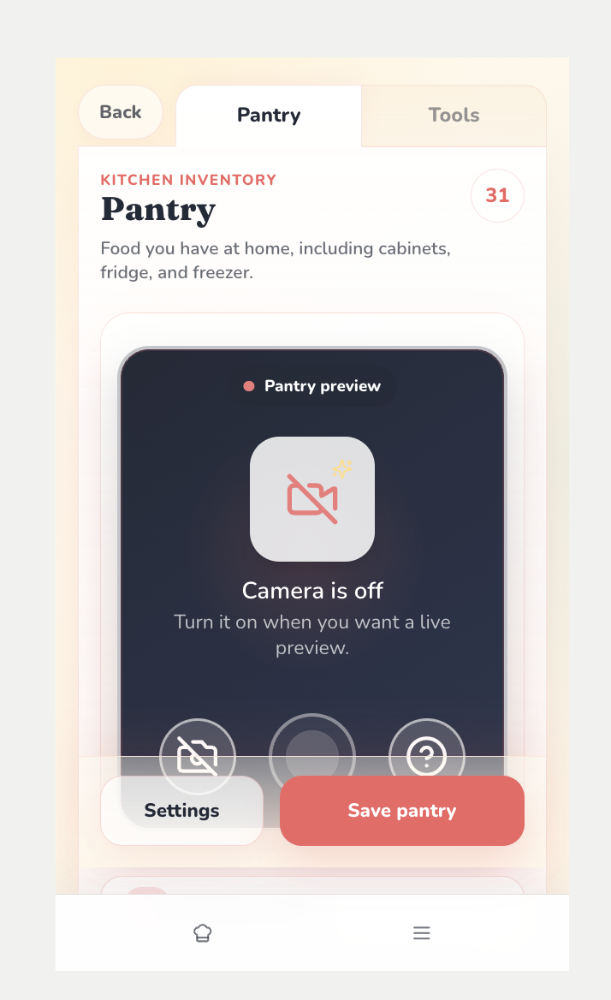
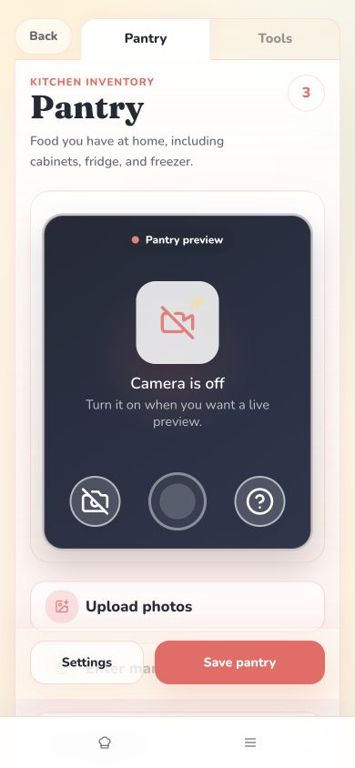

# EFF-033: Returning Settings inventory action-dock parity

**Status:** Open
**Priority:** Pre-production
**Owner:** Wilson / Codex / Claude
**Created:** 2026-07-20
**Updated:** 2026-07-20
**Linked Initiative:** [INIT-001 - Mobile Refresh](../initiatives/INIT-001-mobile-refresh.md)
**Linked Effort history:** [EFF-029 - Setup/Settings camera height and action clearance](effort-029-settings-camera-action-clearance.md)
**Related docs:** [Phase 2.2 Returning Setup / Settings](../product-decisions/features/mobile-refresh/pd-phase-02-2-returning-setup-settings.md), [PD-005 UI Governance](../product-decisions/pd-005-ui-governance.md), [design guidelines](../design_guidelines.md), [production-readiness follow-up](../docs/handoffs/2026-07-20-codex-production-readiness-effort-routing.md)

## One-line summary

Make returning Settings Pantry/Tools actions a visually solid, non-overlapping dock above the app nav, using the first-time setup action rail's containment principles while preserving Settings behavior.

## Context

PR #295 / EFF-029 moved returning Settings actions above the authenticated Cook/Menu bottom nav, but the 2026-07-17 production-readiness pass exposed a second problem inside the Settings content itself. At app-reported `390x844`, `Enter manually` measured `706.58px` to `762.58px`, while the sticky action rail measured `689.41px` to `768px` and the Save button measured `704px` to `752px`. Hit-testing the visible manual-entry center resolved to `Save pantry`.

Wilson's 2026-07-20 screenshot and review identified the accompanying visual inconsistency: the Settings actions look like floating buttons over the camera, and the rail appears transparent compared with the first-time setup rail.

The source confirms a meaningful structural difference:

- First-time setup renders `.setup-bottom-bar` as an in-flow flex sibling after `.setup-scroll-body`, with a bordered cream surface.
- Returning Settings renders `.returning-actions` as `position: sticky` over document content. Its gradient begins at `hsl(var(--returning-cream) / 0.42)`, allowing underlying camera/content to show through.

The issue is therefore not only bottom-nav clearance. The returning rail needs its own visible surface and reserved content geometry so it cannot cover another actionable control.

Wilson-supplied screenshot:

Codex controlled-browser reproduction at `390x844`:

## Scope

- Target returning Settings -> Kitchen Inventory -> Pantry and Tools for guest and linked modes where the shared returning surface applies.
- Preserve the pinned/docked action behavior above the Cook/Menu bottom nav.
- Give the Settings action rail a visually solid/opaque surface so camera or list content does not show through it.
- Apply the first-time setup principles that matter here: a distinct rail surface, clear border/separation, stable action containment, and one owned scrolling region above the rail.
- Reserve enough content space or restructure the shell so `Upload photos`, `Enter manually`, list controls, and dirty reminders never sit underneath the action dock.
- Keep Settings and Save/Save changes buttons readable, tappable, and visually attached to the Settings surface rather than floating over camera content.
- Verify Pantry and Tools, clean and dirty states, section switching, Back/leave prompts, and bottom-nav clearance.
- Save before/after screenshots at the tested iPhone- and Pixel-like viewports.

Out of scope:

- Changing bottom-nav items, order, labels, or auth visibility.
- Changing scan providers, camera/upload/manual-entry behavior, save APIs, schema, prompts, or inventory semantics.
- First-time camera compact sizing; [EFF-032](effort-032-setup-inventory-camera-compact-fit.md) owns that follow-up.
- Settings hub blank-scroll cleanup and timer wording; [EFF-034](effort-034-production-readiness-mobile-p2-cleanup.md) owns those lower-severity findings.

## Decisions made so far

- Wilson requires this fix before the next production push.
- Treat visual opacity and hit-target clearance as one action-dock problem, not separate cosmetic and padding patches.
- Reuse first-time setup containment principles without copying unrelated setup positioning or changing durable navigation.
- The final rail should not rely on translucency over interactive content. A solid surface plus reserved scroll/content space is preferred over increasing z-index alone.

## Open questions

- Should returning inventory use a bounded internal scroll body plus an in-flow dock, or can a sticky dock remain if the content has explicit reserved clearance and the surface is fully opaque?
- Should the action dock share a primitive/token contract with `.setup-bottom-bar`, or remain returning-specific with computed-style parity tests?
- What safe-area/bottom-nav clearance value works across mobile Safari browser chrome and Pixel Chrome without producing the blank-tail problem tracked in EFF-034?

## Agent checklist

- [ ] Start from fresh `origin/main` and confirm no open branch owns returning Settings inventory layout.
- [ ] Read EFF-029, INIT-001, Phase 2.2, PD-005, `design_guidelines.md`, and the 2026-07-20 readiness follow-up.
- [ ] Inspect `UserSettings`, `.returning-ui`, `.returning-inventory-panel`, `.returning-actions`, `.setup-bottom-bar`, and the app-shell bottom nav together.
- [ ] Verify Pantry and Tools at `390x844` and `412x915`, including clean and dirty states.
- [ ] Add geometry/hit-test coverage proving visible manual/upload/list controls are not covered by the dock.
- [ ] Add computed-style evidence for a visually solid rail and compare it with first-time setup.
- [ ] Save before/after screenshots in `docs/assets/mobile-refresh/` and link them from the handoff/PR.
- [ ] Run focused Settings tests, full unit, check, build, exact-head E2E, and Replit mobile validation.

## Resolution criteria

1. Returning Pantry and Tools actions render on a distinct, visually solid dock above the fixed app nav.
2. No camera, upload/manual, list, dirty-reminder, or other interactive content is visible through or hit-testable underneath the dock.
3. `elementFromPoint()` at visible control centers resolves to the intended control at `390x844` and `412x915`.
4. Save, Save changes, Settings, leave/switch prompts, scanning, upload, manual entry, and bottom-nav behavior remain correct.
5. First-time/returning visual comparison and before/after screenshots are committed with exact viewport provenance.

## 2026-07-20 - Effort filed from production-readiness review

Wilson confirmed the returning Settings action rail must be fixed before production and added opacity/parity to the accepted scope. The original EFF-029 remains resolved history for camera proportion and bottom-nav clearance; this new Effort owns the newly observed content-overlap, floating-dock, and translucent-surface behavior.
