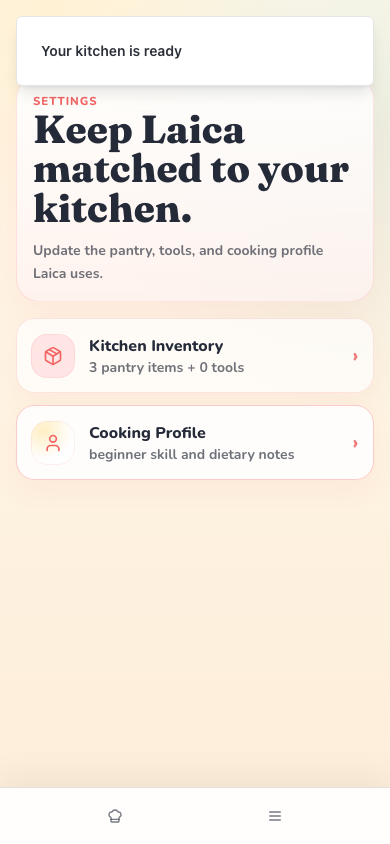
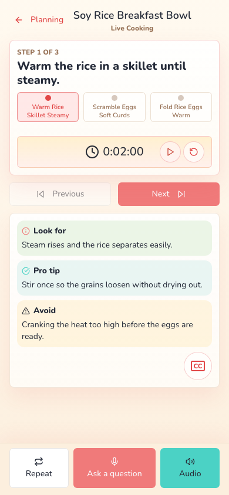

# EFF-034: Production-readiness mobile P2 cleanup

**Status:** In Progress
**Priority:** After pre-production blockers; preserve for the next readiness closeout
**Owner:** Wilson / Codex / Claude
**Created:** 2026-07-20
**Updated:** 2026-07-22
**Linked Initiative:** [INIT-001 - Mobile Refresh](../initiatives/INIT-001-mobile-refresh.md)
**Related docs:** [Phase 2.2 Returning Setup / Settings](../product-decisions/features/mobile-refresh/pd-phase-02-2-returning-setup-settings.md), [Phase 4 Cooking](../product-decisions/features/mobile-refresh/pd-phase-04-cooking.md), [production-readiness follow-up](../docs/handoffs/2026-07-20-codex-production-readiness-effort-routing.md)

## One-line summary

Preserve the two lower-severity mobile readiness findings: Reset should return a timer to Start, and the Settings hub should not have a large blank scroll tail.

## Context

The 2026-07-17 production-readiness pass found two P2 issues that do not independently block production but should not disappear after the higher-priority fixes:

1. After starting and resetting a 30-second Live Cooking timer, the full paused timer was labeled `Resume timer` instead of returning to `Start 30 second timer`.
2. At app-reported `390x844`, the Settings hub had `documentElement.scrollHeight: 1020` with only `844px` of visible height, producing a large empty/inert tail below the actual cards.

Wilson asked on 2026-07-20 that both findings be saved in a separate related Effort.

## Scope

- Live Cooking timer semantics:
  - Distinguish never-started/reset state from paused state.
  - Make Reset return the primary action to `Start <duration> timer`.
  - Preserve Pause, Resume, Time's up, and Restart behavior.
- Settings hub mobile fit:
  - Remove duplicate/unowned bottom clearance that creates a large blank scroll tail.
  - Preserve necessary Cook/Menu nav and safe-area clearance.
  - Verify Settings hero/cards, Back, and bottom navigation remain usable.
- Capture a timer Reset before/after screenshot during implementation and preserve the current Settings screenshot plus its replacement.

Out of scope:

- Returning inventory action-dock overlap/opacity; [EFF-033](effort-033-returning-settings-inventory-action-dock.md) owns that pre-production work.
- First-time setup camera sizing; [EFF-032](effort-032-setup-inventory-camera-compact-fit.md) owns that follow-up.
- Timer duration extraction, server schema/provider changes, bottom-nav IA, or broader Settings redesign.

## Decisions made so far

- Keep both findings P2; neither is a production blocker by itself.
- Use one Effort because Wilson explicitly requested one related P2 record, the two findings came from the same release pass, and their combined Settings/Live Cooking scope has no single phase owner without splitting the accepted follow-up across closed Phase 2.2 and active Phase 4.
- Do not let Settings action-dock work silently absorb the Settings hub tail. Coordinate shared padding changes with EFF-033, but keep acceptance separate.
- The 2026-07-22 branch does not need a separate `hasTimerStarted` flag: Reset clears the elapsed timer value to `0`, so the existing label logic can distinguish ready/reset from paused.
- The extra Settings hub height was owned by both local Settings wrappers and the app phase wrapper. The implementation removes the generic app-phase `pb-20` wrapper for Settings and moves non-inventory Settings hub bottom-nav clearance into the `returning-ui` CSS contract.

## Open questions

- No product questions are open for the current branch. Exact-head GitHub E2E, review, and any Wilson-requested mobile runtime smoke remain before merge/closeout.

## Agent checklist

- [x] Start from fresh `origin/main` and inspect open PR ownership for Live Cooking and Settings layout.
- [x] Read PR #269 timer history, Phase 4, Phase 2.2, EFF-033, and the production-readiness follow-up.
- [x] Add Start -> Pause -> Resume and Start -> Reset -> Start timer assertions.
- [ ] Measure Settings hub document/visual viewport height and necessary bottom-nav/safe-area clearance at `390x844` and `412x915`.
- [x] Preserve before/after screenshots, including a new timer screenshot during implementation.
- [ ] Run focused timer/Settings tests, full unit, check, build, exact-head E2E, and proportionate mobile validation.

## Resolution criteria

1. Reset returns a fresh full timer to the Start label; Pause still returns Resume; completed timers still offer Restart.
2. The Settings hub has no large empty scroll tail beyond the clearance actually needed for the app nav and safe area.
3. No Live Cooking timer behavior, Settings navigation, or bottom-nav interaction regresses.
4. Before/after screenshots and exact viewport measurements are linked from the implementation handoff.

## 2026-07-20 - Effort filed from production-readiness review

Wilson accepted the P2 severity and asked that both lower-priority findings remain discoverable in a related Effort while pre-production Settings and guest-Finish work proceeds separately.

## 2026-07-22 - Timer reset and Settings hub cleanup branch

Daily Efforts hygiene found no active-list, registry, entrypoint, or open-owner drift after EFF-033 and Guest Finish merged. EFF-034 was selected as the next unblocked mobile-readiness slice because it preserves two already accepted P2 findings without requiring a product, provider, schema, security, or Replit-side decision.

Branch `codex/efforts-hygiene-2026-07-22` implements both findings. Live Cooking Reset now clears timer elapsed state back to ready, so Start -> Pause still shows `Resume timer`, while Start -> Pause -> Reset returns to `Start <duration> timer`. Returning Settings hub layout removes duplicate full-screen and bottom-padding owners from the component/app wrapper and lets `.returning-ui` own bottom-nav clearance for non-inventory Settings surfaces.

New screenshot evidence:

- Replacement Settings hub at `390x844`: 
- Timer after Start -> Pause -> Reset at `390x844`: 

Local visual geometry was UI-only: Playwright route stubs supplied `/api/auth/session` and provider routes because the decrypted local Neon endpoint is disabled. The Settings probe at `390x844` reported `documentHeight: 844`, `viewportHeight: 844`, `scrollTail: 0`, and bottom-nav height `57`; the timer probe reported `timerState: {"text":"0:02:00","state":"ready"}` after reset.

Validation passed locally: focused Vitest for Live Cooking, Settings scan policy, setup button CSS, and planning choice; `npm run check`; full `npm run test:unit`; `npm run build`; `npm audit --audit-level=high`; `git diff --check`; and `npx playwright test --project=chromium --list`. The high audit gate still carries the known low `body-parser` and moderate `protobufjs` advisories. Full local DB-backed E2E is not claimed because the configured dotenvx database endpoint is disabled; exact-head GitHub E2E remains required before merge readiness.
