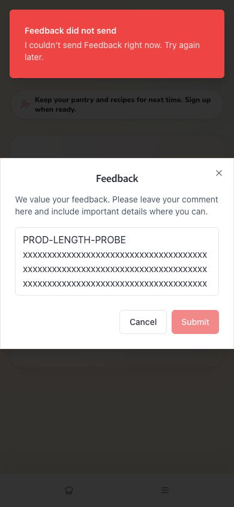

# EFF-037: Align feedback length contract and recovery copy

**Status:** In Progress
**Priority:** P2 — production form reliability
**Owner:** Wilson / Codex / Claude
**Created:** 2026-07-22
**Updated:** 2026-08-05
**Related docs:** [post-publish production regression](../docs/handoffs/2026-07-22-codex-post-publish-production-regression.md)

## One-line summary

Make the Feedback form's client and server length limits agree and return actionable validation copy instead of a false transient-failure message.

## Context

Fresh production testing submitted a safe 289-character probe. The form accepted the input and enabled Submit, but the server rejected it and the UI said only `I couldn't send Feedback right now. Try again later.` Source inspection shows the client accepts up to 300 characters while the server schema caps comments at 280. A short, clearly labeled production probe succeeded immediately afterward, separating the contract mismatch from a general feedback outage.

## Scope

- Choose and document one feedback comment maximum.
- Enforce that maximum consistently in the input, client validation, request schema, and server validation.
- Show length/validation-specific recovery copy and preserve user input after rejection.
- Add boundary tests around max-1, max, and max+1.

Out of scope:

- Feedback moderation, admin workflows, delete APIs, or a broader modal redesign.

## Decisions made so far

- P2/non-blocker: short feedback works and the defect affects only comments in the mismatched range.
- The smallest principled fix is one shared schema/constant plus explicit validation feedback, not a generic retry.
- The production regression created one labeled successful row because no user-facing delete path exists; owner cleanup is recorded in the handoff.

## Open questions

- Answered 2026-08-05 for the current implementation branch: the canonical maximum is 300 characters, matching the pre-existing client promise rather than reducing it to the older generic server `shortTextSchema` cap.
- Should the UI show a live character counter or only a near-limit/over-limit message?

## Agent checklist

- [x] Confirm no active PR or INIT phase already owns Feedback contracts.
- [x] Establish one shared maximum and remove duplicated literals.
- [x] Add client/server boundary and error-copy coverage.
- [ ] Run focused tests, unit, check, build, and the feedback production lane after authorized publish.

## Resolution criteria

1. The client and server accept and reject the same boundary values.
2. Over-limit feedback cannot be submitted as a seemingly valid request.
3. Rejection copy identifies the length issue and keeps the draft available.
4. Short feedback success and existing modal behavior do not regress.

## 2026-07-22 — Filed from fresh production reproduction

The custom-domain form accepted 289 characters, then received a server rejection and displayed generic transient-failure copy. A short labeled probe succeeded, proving the production write path remained available.

## 2026-08-05 — Shared 300-character contract branch

Daily Efforts hygiene selected EFF-037 because EFF-034 already has open PR #334, EFF-022 has adjacent open prompt/eval work in PR #274, and EFF-036 remains blocked on owner-authorized Production-app configuration review. No active INIT phase or open PR owned the feedback length contract.

Branch `codex/eff-037-feedback-contract` implements the smallest contract fix:

- `shared/feedback.ts` owns the 300-character maximum, current-page maximum, typed length code, validation message, and Zod schemas.
- `insertFeedbackSchema` now uses the feedback-specific schema instead of route-local duplication.
- `/api/feedback` returns typed `FEEDBACK_TEXT_TOO_LONG` copy for over-limit comments instead of generic invalid/transient failure copy.
- `FeedbackModal` uses the shared maximum, sends the trimmed draft, blocks over-limit drafts before submit, and keeps the draft when the server returns the typed length error.
- Focused route and modal tests cover max, max + 1, typed copy, and draft preservation.
- During validation, `npm audit --audit-level=high` exposed current-main transitive advisories. The branch includes the lockfile-only `npm audit fix` result for `brace-expansion`, `ip-address`, `postcss`, and `nanoid`; no direct dependency declarations changed, and broad dependency modernization remains deferred.

This branch does not resolve EFF-037 until review/merge and a later authorized production push verifies the feedback form on the custom domain. No feedback moderation, admin workflow, delete API, broader modal redesign, auth, provider, schema migration, or deployment behavior changed.
