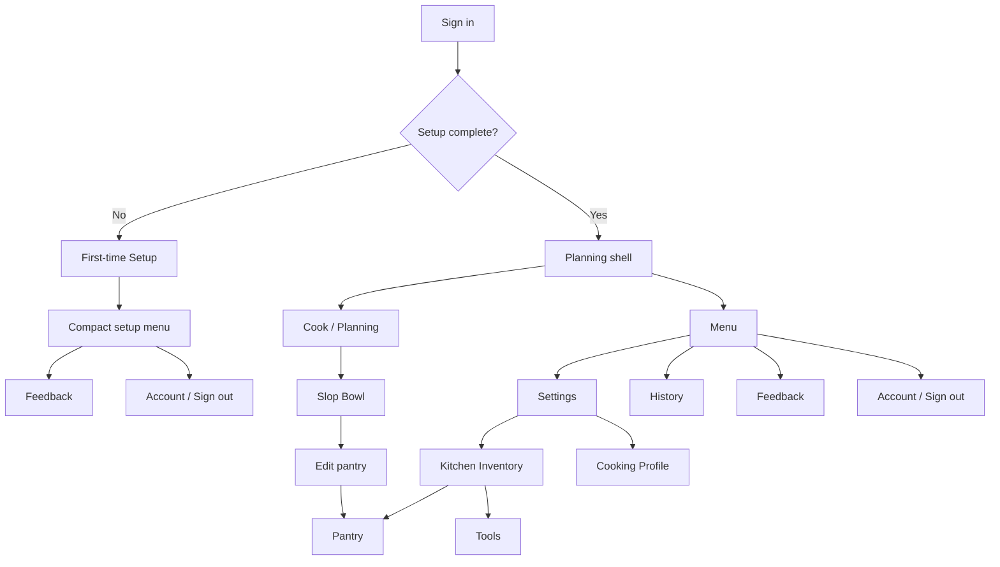

# Mobile Refresh Phase 2.2 - Returning Setup, Settings, and History IA

**Status:** Accepted / Merged PR #30; Kitchen Inventory revision merged PR #170 and polish merged PR #171
**Document kind:** Feature Phase Record
**Phase owner:** Wilson
**Date:** 2026-05-01
**Initiative:** [INIT-001 - Mobile Refresh](../../../initiatives/INIT-001-mobile-refresh.md)
**Storyboard:** [phase-02-2-returning-setup-settings-storyboard.svg](../../../docs/assets/mobile-refresh/phase-02-2-returning-setup-settings-storyboard.svg)

## Goal

Make returning-user setup edits feel like part of the accepted mobile-refresh experience, not a legacy admin page. Menu becomes the global access point for Settings, History, Feedback, Account, and Sign out.

Design conformance is part of the phase, not a later polish pass. A Phase 2.2 PR is not ready if Menu, Settings, or History still feel like the old tabbed Settings page with cosmetic changes.

## Final Outcome

PR #30 merged Phase 2.2 into `main` as merge commit `bc25ef35cb14f32cf6b05507ede77161bd743091`.

Last Replit-validated at: `dc59796ae1602af4643c5fc640be47ab19a59e04`.

Accepted durable outcomes:

- Menu is the canonical global destination surface for returning users.
- Settings and History are separate Menu destinations.
- Settings means "what Laica knows about my kitchen": Kitchen Inventory and Cooking Profile.
- Kitchen Inventory contains Pantry and Tools as separate inventory areas with separate scan sessions.
- History means "what I cooked": a standalone cooking-memory surface.
- Slop Bowl `Edit pantry` deep-links directly into Kitchen Inventory -> Pantry.
- Phase 2.2 stays backend-neutral and reuses existing profile/session APIs.
- First-time setup and returning Settings remain separate top-level flows because user intent differs.
- Both flows read and write the same authenticated profile record through `/api/user/profile`.
- Returning Pantry/Tools/Profile reuse or mirror setup's camera object, upload/manual hierarchy, scanning state, chips, full-row profile choices, and isolated `No restrictions`.
- Differences are allowed for returning-user needs: existing saved data is visible immediately, reset/remove/save controls are explicit, deep-links are supported, and camera stays off until the user turns it on.

## 2026-06-08 Revision - Kitchen Inventory and Optional Tools

Wilson accepted the product-language direction that **Pantry** stays the user-facing food inventory label, because it is warmer and lower-pressure than `Ingredients`, while helper copy clarifies that Pantry includes cabinets, fridge, and freezer. `Tools` replaces visible `Kitchen` / `equipment` language for the non-food inventory area. Backend fields, database columns, scan types, and prompt contracts remain unchanged (`pantryIngredients`, `kitchenEquipment`, and scan type `kitchen`).

PR #170 implemented this revision and merged into `main` as `c164f58a30e1fb382c30fa1ee6d7f2033c20ea0a`. The shipped follow-up also preserves in-progress first-time setup draft state across Replit preview refresh/remounts and explicitly clears that draft when setup finishes or a guest chooses Start Over. PR #171 merged the final UI polish into `main` as `ca13ccd261c328420bfb4292d19905bc5bec4683`.

Accepted behavior:

- First-time setup keeps Pantry as the required food inventory pass, then shows an explicit optional Tools prompt before opening any second camera surface.
- Returning Settings consolidates the former separate Pantry and Kitchen cards into **Kitchen Inventory**, with Pantry and Tools as internal sections.
- Pantry and Tools scans remain separate; this revision does not combine food and tools recognition into one scan.
- Once a user is inside Kitchen Inventory, Pantry / Tools switching belongs in connected browser-style header tabs beside the rounded Back control, not as duplicated rounded section cards inside the content panel. The active tab should visually attach to the panel like a phonebook/folder tab, with inactive tabs clearly recessed; the Kitchen Inventory panel uses a rectangular top edge and rounded bottom corners so the tab rail does not collide with card-radius notches. The Back control stays visually subordinate as a smaller nav chip, not a third tab. Cooking Profile remains reachable through the Settings hub via Back. The old top-right `Settings` chip is removed because it was not actionable.
- The optional Tools intro should lead with `Any kitchen tools to add?`, frame the pass once as `Totally optional!`, and reassure users with `We'll stick to common kitchen basics if you choose to skip.` so adding a special tool does not imply Laica will ignore everyday household kitchen appliances.
- Tools intro iconography should read as kitchen/cookware, not hardware-store tools or generic inventory packages.
- The final first-time setup confirmation hero should use a simple completion checkmark rather than repeating the chef-hat motif.
- User-facing copy should avoid `track` / `tracked` / `tracking` language for inventory capture. Prefer `save`, `add`, `use for suggestions`, `editable`, and `optional`.

## 2026-06-26 Branch Signal - Inventory Unsaved Reminder

Branch `codex/eff-025-settings-unsaved-reminder` starts the direct [EFF-025](../../../efforts/effort-025-settings-unsaved-inventory-reminder.md) implementation slice for returning Settings inventory edits. It keeps the accepted explicit Save model rather than introducing autosave:

- Pantry and Tools edits compare the current local list with the last saved list.
- Dirty Pantry/Tools lists show a small inline unsaved reminder and switch Save copy to `Save pantry changes` / `Save tools changes`.
- Back from Settings and switching away from a dirty inventory list ask before discarding unsaved local edits.
- Reset remains an immediate confirmed save/reset action in this slice; changing reset into a dirty local edit would be a future product pass.

Focused local coverage proves linked and session-local save behavior, dirty reminders, scan-added dirty state, and leave/switch prompts. EFF-025 should not close until Replit/mobile validation confirms the reminder is visible without being noisy.

## Design and UX Gate

- Follow [`design_guidelines.md`](../../../design_guidelines.md), [PD-005](../../pd-005-ui-governance.md), the full-row selection pattern established in setup, and the [Testing and Acceptance Workflow](../../../docs/workflows/testing-and-acceptance.md).
- Treat the Phase 2.2 storyboard as an implementation input, not loose inspiration.
- Settings should be utilitarian but still Laica-native: calm, mobile-first, touch-friendly, and not admin-like.
- History should feel like cooking memory, not account configuration.
- Authenticated app pages should not reintroduce a persistent top header.
- Menu, Settings, and History must share spacing, typography direction, tap targets, icon style, bottom/menu navigation, and hierarchy.
- Main Phase 2.2 surfaces require visual review against the storyboard before merge.

## User Flow

## Implementation Direction

- Add a `history` app phase or equivalent route state so History is no longer a Settings tab.
- Add Settings deep-link state such as `initialSection: hub | inventory | pantry | kitchen | profile`, where legacy `pantry` and `kitchen` open Kitchen Inventory on the matching internal section.
- `Menu -> Settings` opens the Settings hub.
- `Menu -> History` opens standalone History.
- `Slop Bowl -> Edit pantry` opens Settings directly to Kitchen Inventory -> Pantry.
- Keep History v1 light in this phase: standalone destination, existing list/detail/delete behavior, refreshed shell only.
- Do not add new History share/cook-again behavior until Phase 5.

## Visual Consistency Lesson

Wilson's Replit screenshot review caught a portability gap in the first returning Settings alignment pass: the code reused accepted setup class names, but not the `.setup-ui` root specificity that made the first-time setup controls render correctly.

Accepted implementation guardrail:

- Returning setup-aligned surfaces must carry the same specificity guarantees as first-time setup for shared setup controls.
- `setup-action-title` should declare accepted setup button typography directly, not rely only on parent inheritance.
- Visual review must compare computed control shape, typography, icon size, active state, disabled state, and hierarchy against first-time setup whenever setup patterns are reused under a different root wrapper.
- Future component extraction should move these setup/returning shared controls behind a small shared component layer so wrappers cannot silently diverge.

This lesson is now codified in [PD-005](../../pd-005-ui-governance.md) and [`design_guidelines.md`](../../../design_guidelines.md).

## Validation State

Validated scope for PR #30:

- Menu -> Settings and Menu -> History.
- Slop Bowl -> Edit pantry deep-link to Pantry Settings; under the 2026-06-08 revision this opens Kitchen Inventory -> Pantry.
- Pantry, Kitchen, and Cooking Profile saves; under the 2026-06-08 revision Kitchen remains the backend area and is visible to users as Tools.
- History list, expand, delete, and undo-delete after moving History out of Settings.
- Feedback context, including the active surface/subsection.
- Returning Settings visual parity with first-time setup for circular camera controls and upload/manual typography.
- Local `git diff --check`, `npm run check`, `npm run build`, and relevant Vitest coverage.

Validated scope for PR #170:

- GitHub `unit`, `e2e_guest_smoke`, CodeQL, `npm-audit`, and TruffleHog passed at `3b867b94ee9760888d65fc8cc20b5e325ebcd894`.
- Replit Chrome smoke passed at `3b867b94ee9760888d65fc8cc20b5e325ebcd894`: Pantry manual entry, optional Tools intro, Tools manual entry, Preview refresh restoring Tools with `blender`, Start Over clearing the draft, and a fresh guest setup returning to `Yes, Chef!` without stale Tools state.
- PR #171 follow-up added the Tools intro reassurance copy, simplified the final setup hero to a checkmark, promoted Pantry / Tools switching into connected header tabs beside a subordinate Back chip, gave the Kitchen Inventory panel a rectangular top edge with rounded bottom corners, and passed focused/full `user-settings-scan-policy` Vitest coverage, focused/full `user-profiling` Vitest coverage, `npm run check`, `npm run build`, `git diff --check`, GitHub PR checks, and Replit Chrome visual smoke of the Pantry/Tools tab attachment, selected-state swap, and tab/panel seam.

## Acceptance Criteria

- Returning users can open `Menu -> Settings` without starting a Planning flow.
- Returning users can open `Menu -> History`.
- Slop Bowl `Edit pantry` opens directly to Kitchen Inventory -> Pantry.
- Pantry scan, upload, manual add, remove, reset, and save still work.
- Tools scan, upload, manual add, remove, reset, and save still work.
- Cooking Skill and Dietary Restrictions save correctly.
- History list, expand, delete, and undo-delete still work after moving out of Settings.
- Settings no longer contains a History tab.
- Feedback submissions include the active app surface, including Settings subsection where applicable.
- Bottom navigation uses icon-only Cook/Menu actions with accessible labels.
- Visual review confirms Menu, Settings, and History match the Phase 2.2 storyboard and mobile-refresh design principles.
- Visual review confirms returning Pantry/Tools/Profile remain consistent with the accepted Phase 2.1 first-time setup direction while honoring returning-user edit needs.
- Visual review confirms setup-derived controls in returning Settings preserve first-time setup's computed circular camera controls and `Nunito`/800 upload/manual action typography.

## Effort and Governance Interactions

- [PD-005](../../pd-005-ui-governance.md) / [`design_guidelines.md`](../../../design_guidelines.md): Phase 2.2 is a UI-governance pressure test for utilitarian but branded app surfaces.
- Full-row selection pattern: Settings profile choices must keep full-row tap targets.
- [Testing and Acceptance Workflow](../../../docs/workflows/testing-and-acceptance.md): Phase 2.2 adds explicit acceptance and visual-review gates.
- Scan feedback: Pantry/Tools scan outcome feedback remains explicit.
- Shared manual-entry parser: Manual Pantry/Tools entry keeps the shared comma/period parser.
- INIT-001 future pantry work: Pantry spell correction remains deferred in the Mobile Refresh phase records.
- INIT-001 future scan-review work: latest-scan chip states and deeper duplicate refinement remain deferred in the Mobile Refresh phase records.

## Deferrals

- Phase 3 Planning implementation.
- Phase 5 post-cook cleanup, pending cleanup, taste signal, History share/cook-again, and retention.
- Pantry spell correction.
- Semantic scan-session duplicate cleanup.
- Schema changes.

## Historical Detail

Detailed Replit feedback rounds and implementation notes remain in the dated 2026-05-01 handoffs. This phase record keeps the final accepted outcome, validation state, and durable computed-style lesson first so future agents can use Phase 2.2 without reading the full implementation diary by default.
