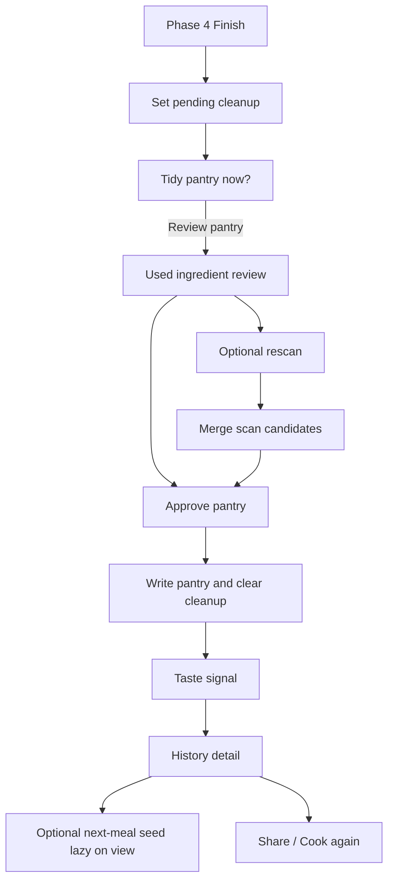
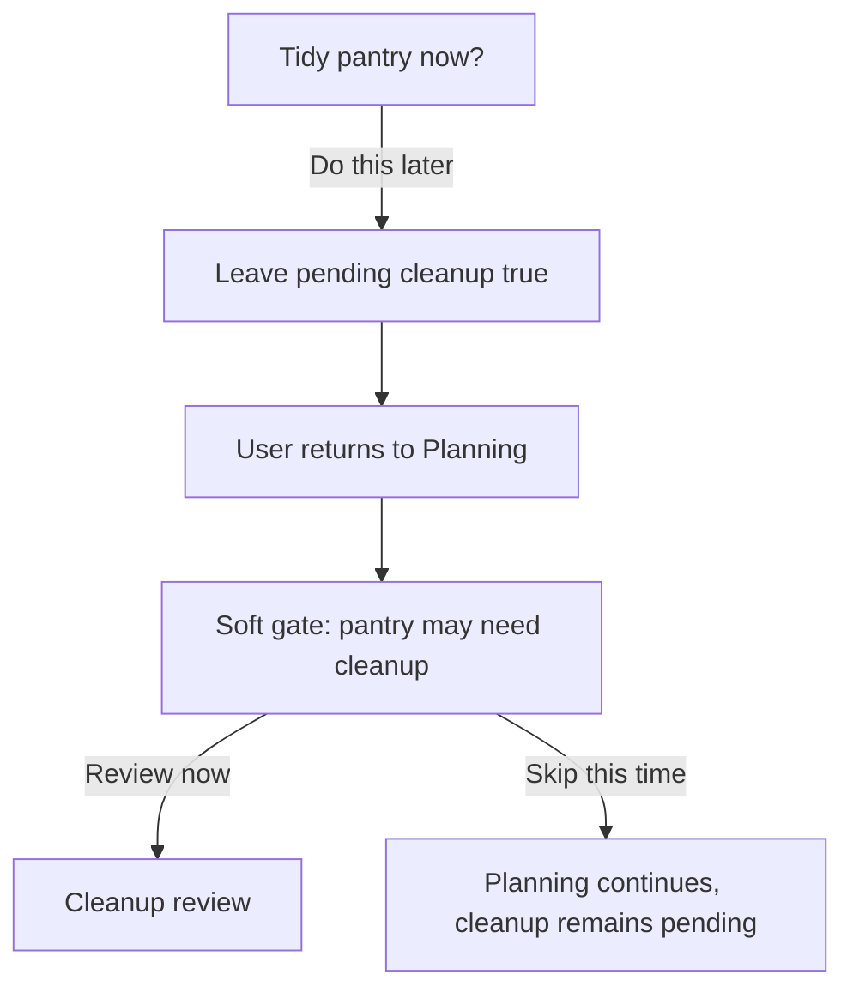

# Mobile Refresh Phase 5 — Post-Cook Cleanup and Retention

**Status:** Accepted
**Document kind:** Feature Phase Record
**Phase owner:** Wilson
**Date:** 2026-04-28
**Initiative:** [INIT-001 — Mobile Refresh](../../../initiatives/INIT-001-mobile-refresh.md)
**Mockup:** [phase-05-post-cook.png](../../../docs/assets/mobile-refresh/phase-05-post-cook.png)

## Goal

Help users come back for a second cook by keeping pantry inventory accurate with minimal work after cooking.

## Decisions

### Flow shape

- After Phase 4 finish, show "Tidy pantry now?"
- Primary action: Review pantry.
- Secondary action: Do this later.
- Do this later leaves cleanup pending and prompts again before the next Planning flow.
- The pre-planning prompt is a soft gate: it interrupts but still allows "Skip this time."

### Phase 4 completion entry contract

- [PR #324](https://github.com/wmishak404/laica/pull/324) merged as `af36e8f03d8cdbb2d3c2178d2726eb8ea8e6bf6a` and defines the typed Phase 4 outcome that future Phase 5 runtime work must consume.
- Only a confirmed `linked-saved` outcome may enter the linked returning-user cleanup, History, cook-again, and taste-memory flow.
- A `linked-save-failed` outcome remains in Live Cooking with its recovery record and `Try Finish again`; Phase 5 must not render cleanup or History success for that cook.
- A `guest-local` outcome completes the browser-local cooking flow but remains outside durable History, cleanup, and taste memory. Promotion remains a separate user-consented sign-up/save path.
- Phase 5 must use the canonical completion outcome rather than infer eligibility from auth mode, callback timing, transcript, speech, or toast copy.
- This merged entry contract does not implement the Phase 5 cleanup prompt, `pending_cleanup`, taste signal, returning-user navigation, guest History import, cook-again, or next-meal behavior.

### Pantry write moments

| Moment | Writes pantry? | Notes |
|--------|----------------|-------|
| Phase 4 Finish | No | Saves history and creates pending cleanup |
| Cleanup -> Approve pantry | Yes | Writes pantry and clears cleanup |
| Cleanup -> Do this later | No | Leaves cleanup pending |
| Rescan merge -> Save | Yes | Merges confirmed new scan items |
| Taste signal -> Submit | No | Writes taste signal only |

### Anonymous-trial clarification

- [PD-012](../../pd-012-public-anonymous-trial-and-account-upgrade.md) sets the guest boundary for v1.
- Anonymous users do not create durable post-cook history, `pending_cleanup`, `taste_signal`, or next-meal retention state.
- Phase 5 remains a linked-account memory surface until a later decision says otherwise.
- Anonymous cooks may continue locally on the same browser/device, but completed anonymous post-cook state is not bulk- or background-retro-imported into durable history in v1.
- Guest cook state can become durable only at a user-consented Google conversion/save moment. The first promotion slice should focus on preserving Pantry, Kitchen, and Cooking Profile; any current-cook or selected-cook History import must be designed as explicit Phase 5/promotion scope with cleanup and taste semantics, not as an automatic anonymous-login side effect.
- The INIT-003 Plan B homepage may ship before Phase 5. That does not pull Phase 5 forward or make cleanup/retention part of the guest MVP.
- If a guest links Google after cooking anonymously, v1 does not backfill anonymous cleanup, taste, next-meal seed, or History retention unless a future product decision explicitly changes the promotion contract.
- Checkpoint: when INIT-001 Phase 5 is implemented and validated, reopen INIT-003 Phase 5/later-promotion planning before adding any guest current-cook or selected-cook History import. The revisit should use the merged Phase 5 semantics for History, cleanup, taste signal, pending cleanup, and next-meal retention rather than guessing ahead of the feature.

### Cleanup review

- Inventory model remains presence-based in v1.
- Used ingredients default to "Still have."
- User can mark "Ran out."
- Nothing changes until the user explicitly saves.
- This conservative default avoids destructive accidental pantry wipes.

### Rescan merge

- Rescan is optional from cleanup review.
- Rescan merges into canonical pantry, not a photo-specific list.
- Labels: `Already saved`, `Found again`, `New`.
- If a previously marked ran-out item is detected again, suggest returning it to "Still have."
- New items require explicit selection before being added.

Merge formula:

```ts
updatedPantry =
  normalizeUnique(currentPantry - confirmedRanOutItems + confirmedNewRescanItems)
```

### Taste and retention

- Taste signal has three lightweight options: Yes, Maybe, Nope.
- Optional note can be captured but should be short and privacy-clamped.
- One next-meal seed may appear after taste signal.
- Next-meal seed generation is lazy on view, not automatic at Finish.
- Full Cook Again Hub is deferred.

### History memory surface

- Phase 2.2 separates History from Settings and refreshes the standalone History shell only.
- Phase 5 owns the richer History purpose: users return after cooking to remember a meal, share it with friends/family, or cook it again because they liked it.
- History detail should become the natural home for `Share`, `Cook again`, taste context, cleanup continuity, and any next-meal seed that follows the completed meal.
- Do not treat History as account configuration or hide it inside Settings.
- Optional post-cook rescans inherit [PD-011](../../pd-011-scan-upload-photo-limit-policy.md): 20 scanned images per inventory refresh and 40 scanned images per day per area unless Phase 5 explicitly documents a later exception.

### Saved recipe surface

- Future explicit recipe bookmarks should live as a **Saved** surface adjacent to History, not as a long-lived hidden planning-session restore.
- Saved is for recipe suggestions the user liked before cooking and may want to shop for or cook later; History is for meals actually cooked.
- Saved and History should live in adjacent menu destinations or adjacent sections within the same memory area, but they should remain semantically distinct.
- Future next-meal seed and taste work should consider Saved recipe signals because they are strong taste indicators, while still avoiding recommendations that become overly narrow or repetitive.
- This is a Phase 5 discussion input, not an implementation goal for the EFF-027 reload-resilience PR.

## Flow Diagrams

### Cleanup path



### Do-this-later path



## Acceptance Criteria

- A confirmed `linked-saved` Finish leads to the post-cook cleanup prompt; `linked-save-failed` and `guest-local` do not enter Phase 5.
- Review pantry shows used ingredients with conservative default "Still have."
- Approve pantry removes only explicitly confirmed ran-out items and adds only confirmed new rescan items.
- Do this later leaves cleanup pending.
- Returning to Planning with pending cleanup shows the soft gate.
- Soft gate can be skipped once without clearing cleanup.
- Rescan merge produces no duplicates and clearly labels already saved/found again/new items.
- Taste signal persists as `yes`, `maybe`, or `nope`.
- Next-meal seed is generated only when viewed.
- History detail supports the Phase 5 memory intent: share and cook-again direction, without turning History back into Settings.
- Saved recipe suggestions, if implemented, appear adjacent to History and remain distinct from completed-cook History records.
- Any future recommendation tuning that uses Saved signals balances user taste learning with cuisine/meal diversity.
- A hidden planning-session recovery cache must not be treated as Saved recipe state.
- Pantry/session mutations require explicit user confirmation and session ownership.
- In v1, only linked users create durable Phase 5 history, cleanup, and taste-memory records.
- Public homepage guest traffic must not create Phase 5 durable memory side effects before Google linking.

## Effort Interactions

- PD-005 / `design_guidelines.md`: Post-cook review follows mobile-refresh design principles.
- Scan feedback: Empty rescan must show explicit no-detection feedback.
- Shared manual-entry parser: Any quick-add in cleanup uses the shared comma parser.
- ADR-0001 and the testing/local-sandbox workflows: New cooking-session fields require Replit-first schema handling.
- EFF-021 / PD-011: Optional post-cook rescan capacity, batching/chunking, progress, partial-success copy, stale-result protection, and image-count rate limits inherit the accepted scan upload photo-limit policy unless this phase records an exception.

## Schema Notes

Add to `cooking_sessions` or equivalent session persistence:

- `pending_cleanup BOOLEAN NOT NULL DEFAULT FALSE`
- `cleanup_completed_at TIMESTAMP NULL`
- `taste_signal TEXT NULL`, validated as `yes | maybe | nope`

Optional index: `(authUserId, pendingCleanup)` for the pre-planning gate query.

Do not introduce quantity-based pantry tracking in v1.
