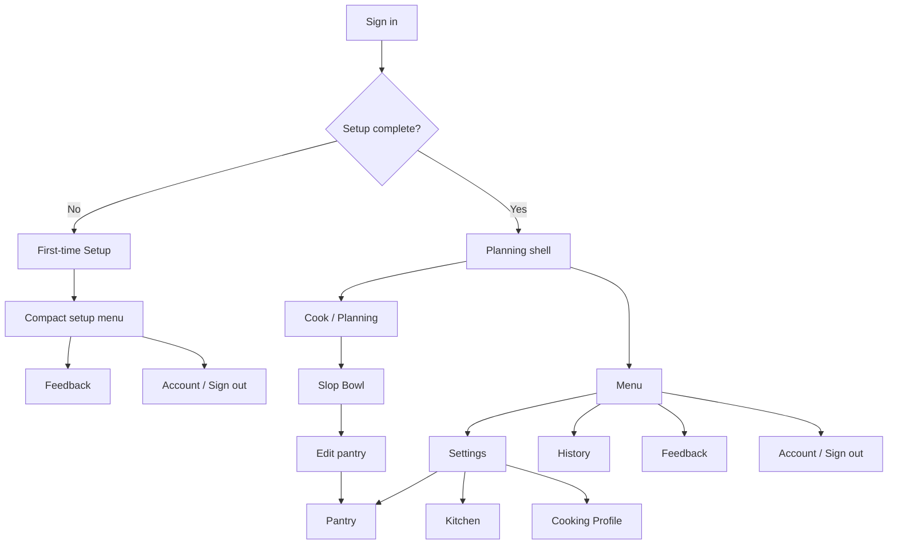
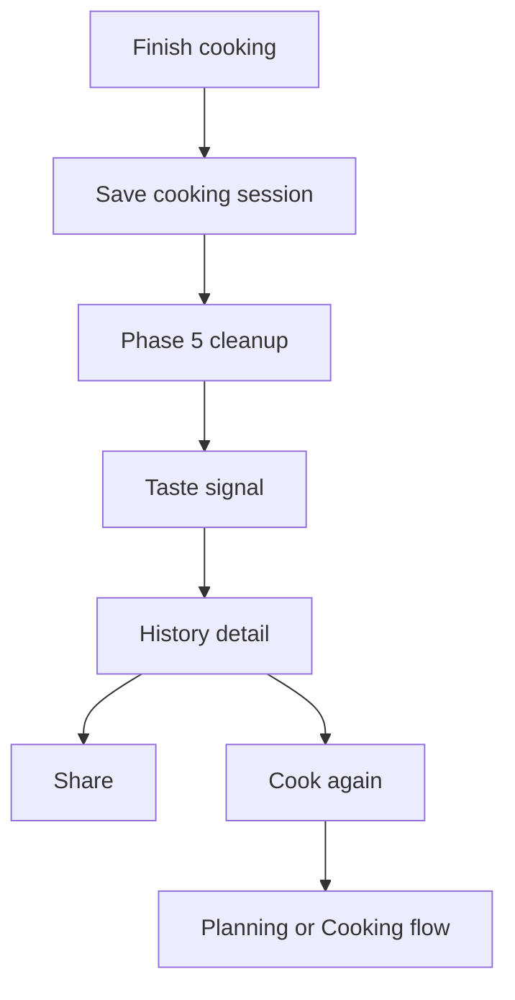

# Mobile Refresh Phase 2.2 — Returning Setup, Settings, And History IA

**Status:** Accepted for implementation
**Phase owner:** Wilson
**Date:** 2026-05-01
**Initiative:** [INIT-001 — Mobile Refresh](../../../initiatives/INIT-001-mobile-refresh.md)
**Storyboard:** [phase-02-2-returning-setup-settings-storyboard.svg](../../../docs/assets/mobile-refresh/phase-02-2-returning-setup-settings-storyboard.svg)

## Goal

Make returning-user setup edits feel like part of the accepted mobile-refresh experience, not a legacy admin page. Menu becomes the global access point for Settings, History, Feedback, Account, and Sign out.

Design conformance is part of the phase, not a later polish pass. A Phase 2.2 PR is not ready if Menu, Settings, or History still feel like the old tabbed Settings page with cosmetic changes.

## Design And UX Gate

- Follow [Mobile Refresh Design Language](design-language.md), [EPIC-001](../../../epics/001-ui-governance.md), [EPIC-004](../../../epics/004-selection-controls-tap-targets.md), [EPIC-005](../../../epics/005-testing-strategy-and-acceptance-criteria.md), and [EPIC-012](../../../epics/012-laica-design-language.md).
- Treat the Phase 2.2 storyboard as an implementation input, not loose inspiration.
- Settings should be utilitarian but still Laica-native: calm, mobile-first, touch-friendly, and not admin-like.
- History should feel like cooking memory, not account configuration.
- Authenticated app pages should not reintroduce a persistent top header.
- Menu, Settings, and History must share spacing, typography direction, tap targets, icon style, bottom/menu navigation, and hierarchy.
- Main Phase 2.2 surfaces require visual review against the storyboard before merge.

## User Flow

## Decisions

- Menu is the canonical global destination surface for returning users.
- Settings and History are separate Menu destinations.
- Settings means "what Laica knows about my kitchen": Pantry, Kitchen, and Cooking Profile.
- History means "what I cooked": a standalone memory surface that Phase 5 will later deepen with share, cook-again, taste, cleanup, and retention behavior.
- Slop Bowl `Edit pantry` deep-links directly into Settings -> Pantry.
- Phase 2.2 stays backend-neutral and reuses existing profile/session APIs.

## Storyboard Surfaces

The storyboard asset includes:

- Planning shell with bottom Menu access.
- Menu destination sheet.
- Settings hub.
- Pantry edit.
- Kitchen edit.
- Cooking profile edit.
- Standalone History list.
- Future Phase 5 History detail direction for share/cook-again.

## Implementation Notes

- Add a `history` app phase or equivalent route state so History is no longer a Settings tab.
- Add Settings deep-link state such as `initialSection: hub | pantry | kitchen | profile`.
- `Menu -> Settings` opens the Settings hub.
- `Menu -> History` opens standalone History.
- `Slop Bowl -> Edit pantry` opens Settings directly to Pantry.
- Keep History v1 light in this phase: standalone destination, existing list/detail/delete behavior, refreshed shell only.
- Do not add new History share/cook-again behavior until Phase 5.

## 2026-05-01 Feedback Follow-Up: Setup/Settings Consistency

Wilson's first Replit review of Phase 2.2 flagged that Pantry, Kitchen, and Cooking Profile in returning Settings felt more different from first-time setup than intended. The implementation rationale was that returning Settings has a different job: it edits already-saved data, supports independent saves/resets, and deep-links from Slop Bowl, while first-time setup is a gated, sequential onboarding flow. That distinction is still valid at the top-level flow.

The recommended product/codebase direction is **not** to keep two fully separate implementations. Keep first-time setup and returning Settings as separate destinations because their navigation and completion rules differ, but centralize the repeated Pantry/Kitchen/Profile building blocks:

- Shared inventory editor composition for Pantry/Kitchen scan, upload, manual entry, scanning state, chip list, and feedback copy.
- Shared cooking-profile choice composition for skill and dietary restrictions.
- Flow-specific wrappers only for step progress, completion gating, back behavior, destructive reset, and independent save/deep-link behavior.

UX recommendation:

- Returning Pantry/Kitchen should visually track first-time setup more closely than the first Phase 2.2 pass.
- Do not auto-initialize the camera when a returning user opens Settings; that would feel heavy and privacy-sensitive.
- Reduce cognitive load by making `Scan` reveal the same camera object inline or in an unmistakably connected sheet, while `Upload photos` remains a direct file picker and `Enter manually` remains a peer path.
- Preserve the returning-user utility needs: visible saved inventory, remove/reset/save controls, and direct deep-link entry from Slop Bowl.

This follow-up means Phase 2.2 should not be considered visually accepted until the Settings sub-surfaces either share the setup component pattern or document a deliberate, reviewed exception.

## Acceptance Criteria

- Returning users can open `Menu -> Settings` without starting a Planning flow.
- Returning users can open `Menu -> History`.
- Slop Bowl `Edit pantry` opens directly to Pantry settings.
- Pantry scan, upload, manual add, remove, reset, and save still work.
- Kitchen scan, upload, manual add, remove, reset, and save still work.
- Cooking Skill and Dietary Restrictions save correctly.
- History list, expand, delete, and undo-delete still work after moving out of Settings.
- Settings no longer contains a History tab.
- Feedback submissions include the active app surface, including Settings subsection where applicable.
- Bottom navigation uses icon-only Cook/Menu actions with accessible labels.
- Visual review confirms Menu, Settings, and History match the Phase 2.2 storyboard and mobile-refresh design principles.
- Visual review confirms returning Pantry/Kitchen/Profile remain consistent with the accepted Phase 2.1 first-time setup direction while honoring returning-user edit needs.

## Epic Interactions

- EPIC-001: Phase 2.2 is a UI-governance pressure test for utilitarian but branded app surfaces.
- EPIC-004: Settings profile choices must keep full-row tap targets.
- EPIC-005: Phase 2.2 adds explicit acceptance and visual-review gates.
- EPIC-007: Pantry/Kitchen scan outcome feedback remains explicit.
- EPIC-009: Manual Pantry/Kitchen entry keeps the shared comma/period parser.
- EPIC-012: Phase 2.2 extends the accepted setup visual pilot into returning-user setup edits without making History feel like Settings.
- EPIC-013: Pantry spell correction remains deferred.
- EPIC-014: Latest-scan chip states and deeper duplicate refinement remain deferred.

## Deferrals

- Phase 3 Planning implementation.
- Phase 5 post-cook cleanup, pending cleanup, taste signal, History share/cook-again, and retention.
- Pantry spell correction.
- Semantic scan-session duplicate cleanup.
- Schema changes.
