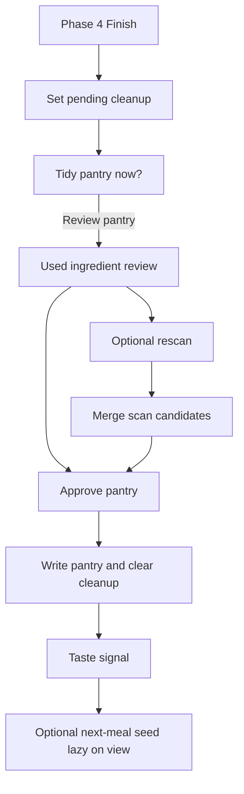
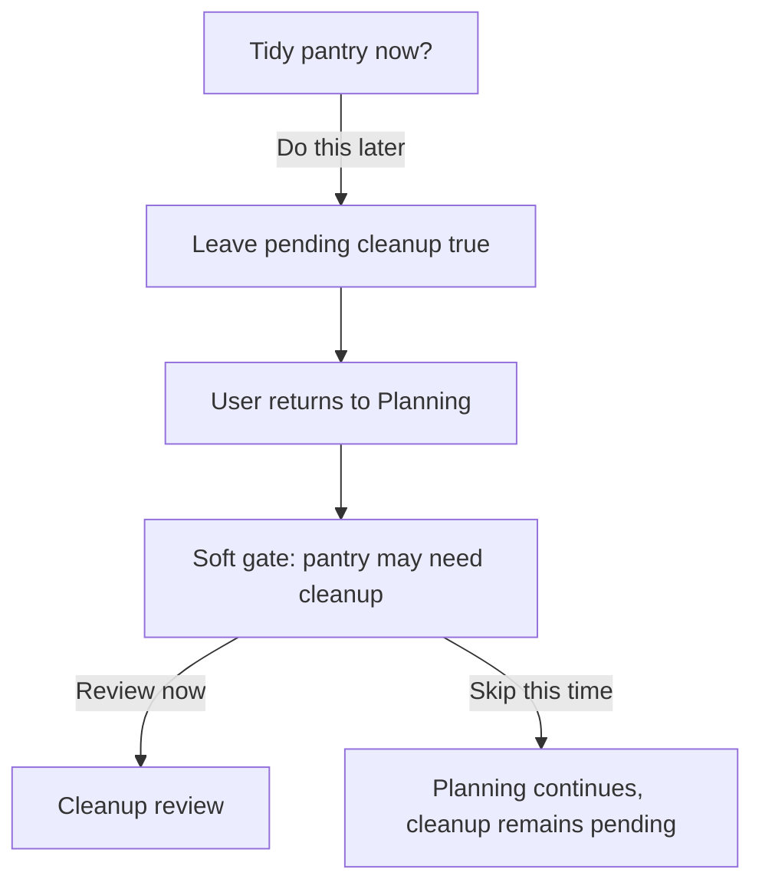

# Mobile Refresh Phase 5 — Post-Cook Cleanup and Retention

**Status:** Accepted
**Phase owner:** Wilson
**Date:** 2026-04-28
**Initiative:** [INIT-001 — Mobile Refresh](../../../initiatives/INIT-001-mobile-refresh.md)
**Mockup:** [phase-05-post-cook.png](../../../docs/assets/mobile-refresh/phase-05-post-cook.png)

## Goal

Help users come back for a second cook by keeping pantry inventory accurate with minimal work after cooking.

## Decisions

### Flow shape

- After Phase 4 finish, show "Tidy pantry now?"
- Primary action: Review pantry.
- Secondary action: Do this later.
- Do this later leaves cleanup pending and prompts again before the next Planning flow.
- The pre-planning prompt is a soft gate: it interrupts but still allows "Skip this time."

### Pantry write moments

| Moment | Writes pantry? | Notes |
|--------|----------------|-------|
| Phase 4 Finish | No | Saves history and creates pending cleanup |
| Cleanup -> Approve pantry | Yes | Writes pantry and clears cleanup |
| Cleanup -> Do this later | No | Leaves cleanup pending |
| Rescan merge -> Save | Yes | Merges confirmed new scan items |
| Taste signal -> Submit | No | Writes taste signal only |

### Cleanup review

- Inventory model remains presence-based in v1.
- Used ingredients default to "Still have."
- User can mark "Ran out."
- Nothing changes until the user explicitly saves.
- This conservative default avoids destructive accidental pantry wipes.

### Rescan merge

- Rescan is optional from cleanup review.
- Rescan merges into canonical pantry, not a photo-specific list.
- Labels: `Already saved`, `Found again`, `New`.
- If a previously marked ran-out item is detected again, suggest returning it to "Still have."
- New items require explicit selection before being added.

Merge formula:

```ts
updatedPantry =
  normalizeUnique(currentPantry - confirmedRanOutItems + confirmedNewRescanItems)
```

### Taste and retention

- Taste signal has three lightweight options: Yes, Maybe, Nope.
- Optional note can be captured but should be short and privacy-clamped.
- One next-meal seed may appear after taste signal.
- Next-meal seed generation is lazy on view, not automatic at Finish.
- Full Cook Again Hub is deferred.

## Flow Diagrams

### Cleanup path



### Do-this-later path



## Acceptance Criteria

- Finish leads to the post-cook cleanup prompt.
- Review pantry shows used ingredients with conservative default "Still have."
- Approve pantry removes only explicitly confirmed ran-out items and adds only confirmed new rescan items.
- Do this later leaves cleanup pending.
- Returning to Planning with pending cleanup shows the soft gate.
- Soft gate can be skipped once without clearing cleanup.
- Rescan merge produces no duplicates and clearly labels already saved/found again/new items.
- Taste signal persists as `yes`, `maybe`, or `nope`.
- Next-meal seed is generated only when viewed.
- Pantry/session mutations require explicit user confirmation and session ownership.

## Epic Interactions

- EPIC-001: Post-cook review follows mobile-refresh design principles.
- EPIC-007: Empty rescan must show explicit no-detection feedback.
- EPIC-009: Any quick-add in cleanup uses the shared comma parser.
- EPIC-010: New cooking-session fields require Replit-first schema handling.

## Schema Notes

Add to `cooking_sessions` or equivalent session persistence:

- `pending_cleanup BOOLEAN NOT NULL DEFAULT FALSE`
- `cleanup_completed_at TIMESTAMP NULL`
- `taste_signal TEXT NULL`, validated as `yes | maybe | nope`

Optional index: `(authUserId, pendingCleanup)` for the pre-planning gate query.

Do not introduce quantity-based pantry tracking in v1.
